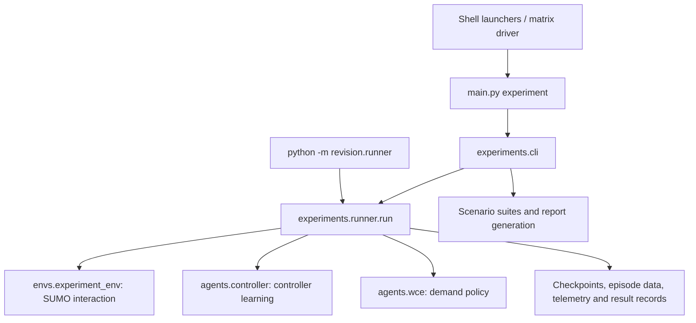

# CB-WCE Repository Handover

**Snapshot date: 7 October 2026**  
**Audience:** a colleague taking over the repository and tracing its implementation, training history and experimental outputs.  
**Configured repository:** [TravidP/updated_worst_case_MARL](https://github.com/TravidP/updated_worst_case_MARL), branch `revision`. This identifies the local Git configuration; remote contents, pushes and Releases were not audited for this handover.

## 1. Start here

CB-WCE investigates traffic-signal robustness under changing demand. Intersection controllers choose signal actions; a learned worst-case demand generator (WCE) chooses mixtures of eleven traffic profiles. The revised study uses a 5×5 Grid and a Monaco subnet, four controllers (`ia2c`, `ma2c`, `iqll`, `ppo`) and five continuation methods. `iqll` means Independent Q-Learning with Linear Regression.

The selected study has **8 parents → 8 offline WCE models → 40 final controllers → 9,200 main evaluation rollouts**, with training seed **101**. There are also independent supplementary evaluations. These counts describe the selected study and saved results; ten evaluation rollouts are not ten independent training seeds.

Suggested reading order:

1. This handover, then the [project README](README.md) and [full revised protocol](reviewer_revision_plan.md).
2. [Current protocol configuration](config/revised/protocol.json), [final model selection](runs_eval/revised/selections/final_evaluation_seed101.json), and the code map below.
3. [Training launcher guide](scripts/training/README.md), followed by the actual runner and learner implementations.
4. [English WCE diagnosis](reports/wce_analysis_20261006/report_en.md) and [evaluation figure guide](evaluation%20results%20figs/README.md).
5. The [complete evaluation PDF](evaluation%20results%20figs/complete_evaluation_report.pdf) and [supplementary real-world evaluation PDF](evaluation%20results%20figs/real_world_evaluation_report.pdf).

**How to interpret older documentation:** September reports are dated evidence, not live status. In particular, `revision/README.md` and `docs/INTEGRATION_REPORT.md` retain statements that publication training had not started. The 21 September progress note predates completion of the continuations. The final selection, generated on 29 September, still records zero accepted formal evaluations; later result exports contain 4,600 main rollouts per network. That selection remains the checkpoint identity inventory, not a current evaluation-completion ledger. Current queue processing and learner reward scaling must be read from the executable code and effective INIs, because some older paragraphs describe superseded settings.

## 2. Revision and retraining history

Experiment dates and Git commit dates differ. Run IDs contain UTC timestamps indicating attempt creation, not exact completion times. The selected `result.json` records establish completion and budgets. The timeline below therefore uses dates/ranges without inferring completion timestamps from folder names.

| Period | Work and resulting state | Evidence / navigation |
| --- | --- | --- |
| 14 September | Correction work initially used a separate `revision/` path. C01–C10 addressed evaluation mode, queue measurements, RNG separation, learning cadence, partial batches, recovery and related workflow checks. The implementation was integrated into the existing project. | [Historical correction implementation](revision/IMPLEMENTATION.md), [revision audit](reviewer_revision_audit_2026-09-14.md), [integration report](docs/INTEGRATION_REPORT.md). These record deterministic tests and eight integration pilot cases, not the full trained study. |
| 15 September | Revised the study to one training seed, eight parents, eight WCE runs, forty continuations and 9,200 evaluations; added optional SUMO visualization. | [Revision plan](reviewer_revision_plan.md), [visualization guide](docs/VISUALIZATION.md); commit `8fd0e62` records the plan update. |
| 16 September onward | Changed endpoint reward handling and native training monitoring; preserved earlier artifacts and prepared fresh training. Subsequent learner-boundary scaling/configuration work made learner settings explicit in revised INIs. Screening tools support frozen trajectories, offline candidates, paired pilots and guarded promotion. | [Endpoint monitoring report](docs/ENDPOINT_MONITORING_REPORT.md), [monitoring guide](docs/TRAINING_MONITORING.md), [configuration screening](docs/REVISED_TUNING.md). Screening tools being present does not prove every proposed screening phase was executed; consult its saved campaign records. |
| 17–19 September | Selected fresh parent attempts started on 17–18 September; selected offline WCE attempts started on 18–19 September. All eight selected parents and all eight selected WCE runs have complete results. | [Parent/WCE selection](runs_eval/revised/selections/publication_seed101.json), [final selection](runs_eval/revised/selections/final_evaluation_seed101.json), selected run manifests/results. |
| 19–26 September and subsequent completion | Selected baseline attempts started on 19/21 September; random-group attempts on 22 September; domain-randomization attempts on 23 September; fixed-WCE attempts on 24–25 September; online-WCE attempts on 25–26 September. All forty selected continuations were complete by the 29 September selection. | [21 September progress snapshot](docs/TRAINING_PROGRESS_20260921_zh.md) explains then-pending/resumed jobs; the final selection and each run's result establish the later complete state. |
| 29 September onward | Protocol v7 defines versioned scenarios/artifacts and the frozen final evaluation matrix. The main campaign results were subsequently exported and reconciled for both networks: 9,200 rollouts total. | [Evaluation workbook](docs/evaluation_workbook/cb_wce_evaluation_workbook.md), [parallel campaign driver](docs/evaluation_workbook/run_publication_parallel.py), local `runs_eval/revised/publication_seed101_v1/`, viewer validation JSONs. |
| 6 October | Produced the WCE/controller diagnosis, paired comparisons and training-evidence inventory; ran supplementary Grid demand evaluation, legacy Monaco replay and repaired-topology Monaco transfer evaluation. Preserved main results as separate datasets. | [Analysis report](reports/wce_analysis_20261006/report_en.md), execution reports and acceptance records in the same folder, supplementary campaigns listed below. |
| 6 October commits | Preserved revised workflow/configuration (`09f7532`), removed generated artifacts from normal Git tracking while retaining local copies (`fe80181`), added portable result reproduction (`29cbb4a`), updated paper material (`5b1ccda`), and selected 56 model bundles for Git LFS (`b870d7a`). | Local Git history; [data policy](docs/REPOSITORY_DATA_POLICY.md). These commit dates do not date the original training. |
| 7 October | Added the expanded standalone results package and English evaluation figures, tables and PDF reports. The figure validation records cover 48 scenarios, 960 groups and 9,600 displayed rollouts. | Commit `31db63d`; [figure validation](evaluation%20results%20figs/validation_report.json), [PDF validation](evaluation%20results%20figs/latex/validation_report.json), [portable package guide](docs/evaluation_workbook/grid_results_site/packages/CBWCE_Results_Portable_20261007_README.md). |

## 3. Actual program execution and code map

### Entry points and the role of `revision/`

Use **`python main.py experiment ...`** for the revised workflow. The historical `main.py train/evaluate`, `train_adversary*.py`, `train_coevolution*.py` and `eval_signal_controllers*.py` remain useful for historical context, but they are not the revised experiment dispatch. Calling an old entrypoint does not automatically enable the revised corrections.



`revision/` was the initial correction package. It now retains compatibility commands and historical verification evidence while importing the integrated implementation:

| Compatibility module | Current implementation |
| --- | --- |
| [revision/runner.py](revision/runner.py) | [experiments/runner.py](experiments/runner.py); its `__main__` calls `run(parser().parse_args())`. |
| [revision/learning.py](revision/learning.py) | [agents/controller.py](agents/controller.py) and [agents/wce.py](agents/wce.py). |
| [revision/environment.py](revision/environment.py) | [envs/experiment_env.py](envs/experiment_env.py). |
| [revision/recurrent.py](revision/recurrent.py) | [agents/recurrent.py](agents/recurrent.py). |
| [revision/core.py](revision/core.py), [revision/checkpoint.py](revision/checkpoint.py), [revision/demand.py](revision/demand.py), [revision/verify.py](revision/verify.py) | Corresponding `experiments` modules. |
| [revision/tests.py](revision/tests.py), [revision/verification/](revision/verification/) | Correction tests and historical evidence; read dates/source hashes before applying a gate to current code. |

The compatibility runner uses `--stage` and requires explicit `--output`. The main CLI accepts the stage as a subcommand, supplies a default output path, and additionally handles scenario suites, preparation, dashboards and reports.

### Where to read each behavior

| Code | Responsibility |
| --- | --- |
| [main.py](main.py), [experiments/cli.py](experiments/cli.py) | Experiment dispatch, argument handling, suite evaluation and public commands. |
| [experiments/runner.py](experiments/runner.py) | The shared parent/WCE/continuation loop, checkpoint loading, monitoring, rollout execution and completion/failure records. Start with `run()`. |
| [experiments/configuration.py](experiments/configuration.py), [experiments/protocol.py](experiments/protocol.py), [config/revised/](config/revised/) | Effective controller/WCE INIs, strict settings, budgets, scenario roots and output conventions. |
| [experiments/core.py](experiments/core.py) | Deduplicated queue domain, raw rewards, separate RNG streams, rollout validation and run records. |
| [experiments/demand.py](experiments/demand.py), [experiments/prepare.py](experiments/prepare.py), [experiments/scenarios.py](experiments/scenarios.py) | Normalized OD profiles, mixed demand, route/departure materialization and seen/test/validation scenarios. |
| [envs/experiment_env.py](envs/experiment_env.py) | Network construction, SUMO resets, observations, actions and one-second measurements. |
| [agents/controller.py](agents/controller.py), [agents/recurrent.py](agents/recurrent.py), [agents/policies.py](agents/policies.py) | Controller adaptation, reward transformation, recurrent policies and underlying policy/loss implementations. |
| [agents/wce.py](agents/wce.py) | Gaussian-logit demand weights, block experience, episode returns and WCE updates. |
| [experiments/checkpoint.py](experiments/checkpoint.py), [experiments/monitoring.py](experiments/monitoring.py), [experiments/telemetry.py](experiments/telemetry.py) | Complete recovery bundles, fixed monitoring tests and learner/TensorBoard output. |
| [experiments/verify.py](experiments/verify.py), [tests/](tests/) | Source-specific integration verification and focused correction/workflow/configuration/monitoring/launcher/restore tests. |
| [experiments/reporting.py](experiments/reporting.py) | Experiment report tables, figures and dashboard export. The later viewer/figure/PDF exporters are separate scripts. |

### Preparation and gates

The runner loads network/controller-specific revised INIs and WCE configuration, records effective settings and input hashes, and creates a new exclusive attempt directory. Grid profiles live under [data_traffic/revised/](data_traffic/revised/); Monaco profiles under [real_net_subnet/demand_groups/revised/](real_net_subnet/demand_groups/revised/). Protocol-v7 scenario definitions are below their `protocol_v7/` directories; the seen scenario definitions share the `test/` directory.

`prepare` establishes inputs/scenarios; `prepare --materialize` generates complete routed evaluation demand. Training also materializes each 600-second demand block during the episode. Evaluation freezes materialized vehicles and reuses paired artifacts across controller/method comparisons.

Publication **training** requires a passed C01–C10 gate whose recorded source, input and evidence hashes still match. Pilot seeds are separate from publication seed 101. A historical passing gate is evidence for its recorded source, not a universal certificate. Suite evaluation enforces final checkpoint budgets and rollout counts; the runner's gate requirement applies to parent/WCE/continuation publication training, so passing `--gate` to evaluation alone does not certify a release.

### Training loop and budgets

Each full training episode is **6,600 seconds = 11 × 600-second demand blocks = 1,320 five-second controller transitions**. For each block the runner selects profile weights, generates/inserts vehicles, then repeats `Controller.act → env.step → Controller.observe` up to 120 times. SUMO measurements are recorded every second. At episode boundaries the runner flushes pending controller batches, writes episode data, and saves/monitors at the configured intervals. The parent budget can end part-way through its last episode; partial batches are masked rather than counted as extra transitions.

| Stage/method | Demand selection | Controller learning | WCE learning | Budget |
| --- | --- | --- | --- | --- |
| Parent | Eleven one-hot profiles in fixed order. | Enabled. | No WCE. | 1,000,000 learning steps. |
| Offline WCE | State-dependent WCE mixture every 600 seconds. | Frozen parent. | Enabled, once per full episode. | 500 episodes; 660,000 controller simulation transitions; 500 WCE updates. |
| `baseline` | Same ordered one-profile curriculum as parent. | Enabled. | No WCE. | 1,320,000 additional learning steps. |
| `random_group` | Random one-hot profile each block. | Enabled. | No WCE. | Same continuation budget. |
| `domain_randomization` | New Dirichlet mixture each block. | Enabled. | No WCE. | Same continuation budget. |
| `fixed_wce` | Corresponding pretrained WCE selects mixtures. | Enabled. | Parameters frozen. | Same continuation budget. |
| `online_wce` | Same pretrained WCE, adapting during continuation. | Enabled. | Enabled, once per full episode. | Same continuation budget; 1,000 additional WCE updates. |

All five branches start independently from the **same corresponding one-million-step parent**, not from each other. Fixed and online WCE load the same matching pretrained adversary; the runner checks its parent hash. Final controllers reach **2,320,000 cumulative learning steps**. Frozen WCE parameters still produce state-dependent stochastic mixture weights.

**Rewards and learning:** `QueueMetric.rewards()` uses the queue at the end of the five-second action. IA2C/PPO/IQLL receive shared negative total queue; MA2C receives negative local queue plus 0.9-weighted neighbor queue. `Controller.transform_rewards()` divides by the INI `reward_norm` and clips when configured, at the learner boundary. Raw and learner rewards are saved separately. Current `QueueMetric.wce()` returns positive mean total queue over exactly 600 samples; `WCE.observe()` applies its own configured normalization/clipping. Thus raw queue, raw reward and learner reward are different quantities. Evaluation reports uncapped queue in vehicles.

### Which controller code to inspect

| Controller | Implemented learning path |
| --- | --- |
| IQL-LR (`iqll`) | `Controller` builds `LRQPolicy`: linear Q values, epsilon-greedy training and greedy evaluation. Replay capacity 1,000; every 20 new learning transitions triggers ten sampled updates per agent, batch size 20 in the selected configuration. Adam; the bootstrap uses the same online Q function. No recurrent state or separate target network. |
| IA2C | `CompactPolicy`: separate recurrent actor and critic, wave feature branch and Grid-only local wait branch. On-policy batches, bootstrapped returns and advantages; one optimization pass per batch, RMSProp. |
| MA2C | `CompactFingerprintPolicy`: recurrent actor/critic with neighbor policy fingerprints and neighborhood handling. Read environment feature construction together with the controller and recurrent code. One optimization pass per batch, RMSProp. |
| PPO | `CompactPolicy` with clipped policy objective in `masked_loss()`, saved old action probabilities and four epochs per fresh batch in the selected configuration. Advantage normalization and Adam. Repeated epochs reuse the same starting recurrent state. |
| WCE | Grid uses the Gaussian CNN actor–critic; Monaco uses the Gaussian GCN actor–critic. Eleven sampled logits become normalized softmax weights. After eleven block transitions, episode returns/value advantages drive one update. |

Controller values above describe the selected revised configurations; inspect the exact run manifest's `controller_effective_config` for historical identity. Grid observations include local wait features; Monaco does not. Layer diagrams and detailed settings are in sections 4.2–4.4 of the [English diagnosis](reports/wce_analysis_20261006/report_en.md).

### Monitoring, checkpoints and resume

Parents and continuations run three fixed 600-second Uniform monitoring rollouts before learning, every 50 complete episodes, and at the final budget. Monitoring preserves training state and does not automatically stop a run for degradation. Inspect fixed-monitor queue alongside learner reward when adversarial demand becomes harder.

Checkpoints normally save every ten complete episodes and at final budget. Bundles contain TensorFlow variables including optimizer slots, model state/replay or pending data, recurrent state, runner counters and independent RNG streams. A checkpoint manifest with file hashes marks completeness. Resume requires the same stage/method/budget/seed, matching parent/WCE identities and monitoring settings; it creates a new attempt rather than overwriting the old run. Legacy weight-only models are not complete continuation states.

`checkpoint_001320000` means **1,320,000 transitions in this continuation stage**; `result.json.learning_steps` is **2,320,000 cumulative controller-learning steps**. Offline WCE's `checkpoint_000660000` counts frozen-controller simulation transitions, not extra controller learning. Checkpoints contain pickle state; use the trusted selected bundles.

### Evaluation and export flow

`experiments.cli.evaluate_suite()` expands eleven seen and twelve test scenarios, each with ten rollouts. `--suite all` covers these 23 scenarios; the six validation scenarios are separate. It resolves shared demand artifacts and assigns arrival/SUMO/policy randomness. Arrival seeds are 51001–51010 and SUMO seeds 61001–61010. The suite derives policy seeds from the training seed and rollout index; a direct single-artifact run can accept an explicit policy seed.

The runner loads a final 2,320,000-step controller, sets evaluation mode, injects the artifact and runs 720 five-second actions. Learning is disabled. A valid rollout needs exactly 3,600 consecutive one-second samples. It writes raw measurements, trip summaries and a completion record; interrupted attempts retain partial output and cannot enter complete summaries.

One final controller produces 230 main rollouts. Forty controllers produce 9,200. The main campaign's saved layout is under `runs_eval/revised/publication_seed101_v1/`; a fresh CLI evaluation without `--output` uses the generic timestamped evaluate layout. Viewer exporters reconcile the raw data, then figure and PDF scripts read the exported snapshot without running training or simulation.

## 4. Commands and launchers

Run from the repository root. Training uses the established `deeprlsc` environment (Python 3.6.13 / TensorFlow 1.12.0 for most selected runs). Three selected Grid baselines—IA2C, MA2C and PPO—used Python 3.10.12 / TensorFlow 2.15.1; their manifests record this difference. The current checkout is not guaranteed to match every historical training source hash, so a new run is not automatically an exact reproduction of a selected model's training.

These are representative commands, **not commands executed for this handover**. Replace all `/replace/with/...` values. Gate creation can run simulation; preparation/export commands can write outputs.

```bash
conda activate deeprlsc
export PYTHONDONTWRITEBYTECODE=1
export OPENBLAS_NUM_THREADS=1
export OMP_NUM_THREADS=1
export TF_CPP_MIN_LOG_LEVEL=2

python main.py experiment prepare
python main.py experiment check
# For new publication training, obtain a gate matching the source/inputs:
python main.py experiment verify --workers 4

export CBWCE_GATE='/replace/with/passing/gate.json'
export CBWCE_PARENT='/replace/with/selected/parent/checkpoint_001000000'
export CBWCE_WCE='/replace/with/matching/wce/checkpoint_000660000'
export CBWCE_FINAL='/replace/with/selected/final/checkpoint_001320000'

python main.py experiment parent --network grid --controller ia2c \
  --seed 101 --gate "$CBWCE_GATE" --no-visualization
python main.py experiment wce --network grid --controller ia2c \
  --seed 101 --gate "$CBWCE_GATE" --parent "$CBWCE_PARENT" --no-visualization
python main.py experiment continue --network grid --controller ia2c \
  --seed 101 --method online_wce --gate "$CBWCE_GATE" \
  --parent "$CBWCE_PARENT" --wce "$CBWCE_WCE" --no-visualization
python main.py experiment evaluate --network grid --controller ia2c \
  --seed 101 --parent "$CBWCE_FINAL" --suite all --rollouts 10 --no-visualization
python main.py experiment report --input '/replace/with/selected/evaluation/suite'
```

For `baseline`, `random_group` and `domain_randomization`, omit `--wce`. For resume, add `--resume '/replace/with/same-stage/checkpoint'` while retaining the original stage inputs and total budget. The compatibility equivalent of a parent command is:

```bash
python -m revision.runner --stage parent --network grid --controller ia2c \
  --seed 101 --gate "$CBWCE_GATE" \
  --output '/replace/with/new/exclusive/attempt' --no-visualization
```

| Launcher | Purpose |
| --- | --- |
| [01_parent.sh](scripts/training/01_parent.sh), [02_wce.sh](scripts/training/02_wce.sh) | Single parent or offline WCE job. |
| [03_baseline.sh](scripts/training/03_baseline.sh) through [07_online_wce.sh](scripts/training/07_online_wce.sh) | Single continuation job for each method. |
| [08_all_parents.sh](scripts/training/08_all_parents.sh), [09_all_wce.sh](scripts/training/09_all_wce.sh) | Network/controller matrices. |
| [10_all_baseline.sh](scripts/training/10_all_baseline.sh) through [14_all_online_wce.sh](scripts/training/14_all_online_wce.sh), [15_all_continuations.sh](scripts/training/15_all_continuations.sh) | Per-method matrices or all continuation methods. |
| [_launch.sh](scripts/training/_launch.sh), [_matrix.py](scripts/training/_matrix.py) | Build actual CLI commands, resolve selected inputs and manage worker jobs. |
| [16_remaining_continuations_with_cleanup.sh](scripts/training/16_remaining_continuations_with_cleanup.sh), [_remaining_campaign.py](scripts/training/_remaining_campaign.py) | Follow-up campaign orchestration and its cleanup behavior; read these before reusing historical follow-up procedures. |
| [16_tune_all_revised.py](scripts/training/16_tune_all_revised.py), [experiments/tuning.py](experiments/tuning.py), [experiments/offline_screen.py](experiments/offline_screen.py) | Guarded configuration screening and promotion workflow. |
| [run_publication_parallel.py](docs/evaluation_workbook/run_publication_parallel.py), [generate_artifacts.py](docs/evaluation_workbook/generate_artifacts.py) | Main paired evaluation campaign and artifact generation. |

The shell launchers accept `--mode publication` or pilot settings and support command preview with `--dry-run`; see the [launcher guide](scripts/training/README.md) for matrix selection/worker options. The basic stage CLI does not automatically launch the full study.

## 5. Models, inputs and raw result locations

**Availability terms:** “tracked” means present in the local Git index; “LFS” means tracked through Git LFS; “local” means present in this checkout but normal cloning does not retrieve it. This does not assert that every local commit/LFS object was uploaded.

| Location | Purpose | Availability |
| --- | --- | --- |
| [final_evaluation_seed101.json](runs_eval/revised/selections/final_evaluation_seed101.json) | Exact 8 parent, 8 offline WCE and 40 continuation identities, checkpoint hashes, originating manifests/results and 40 evaluation suites. Prefer `checkpoint_path` (relative) over old machine-specific absolute paths. | Tracked. |
| [publication_seed101.json](runs_eval/revised/selections/publication_seed101.json) | Parent/WCE input selection for training matrices; earlier selection state. | Tracked. |
| [runs/revised/](runs/revised/) | Parents for both networks and baseline continuations. | Selected bundles are LFS; selected origin manifests/results tracked; most logs/intermediate output local. |
| [output_adversary/revised/](output_adversary/revised/), [output_adversary_monaco/revised/](output_adversary_monaco/revised/) | Grid / Monaco offline WCE models. | Same selected-bundle exception; historical output local. |
| [output_coevolution/revised/](output_coevolution/revised/), [output_coevolution_real/revised/](output_coevolution_real/revised/) | Grid / Monaco non-baseline continuations. | Same selected-bundle exception; historical output local. |
| [config/revised/](config/revised/), [data_traffic/revised/](data_traffic/revised/), [real_net_subnet/demand_groups/revised/](real_net_subnet/demand_groups/revised/) | Effective configuration, normalized training demand and versioned scenario definitions. | Configuration/definitions tracked; generated frozen artifacts are generally local. |
| `runs_eval/revised/publication_seed101_v1/` | Original main evaluation suites, scheduler records and per-rollout attempts for both networks. | Local; campaign driver is tracked. |
| `runs_eval/revised/external_group12_seed101_v3/` | Accepted supplementary Grid campaign: 200 formal rollouts plus separate smoke tests, artifacts, analysis and acceptance. Earlier v1/v2 attempts retain preflight failures. | Local raw campaign; report evidence/exported supplementary data tracked. |
| `runs_eval/revised/monaco_legacy_group12_seed101_v1/` | Legacy Monaco replay with partial/skipped demand, 200 rollouts, separate inventory and acceptance. | Local raw campaign; archival viewer exports tracked. |
| `runs_eval/revised/monaco_repaired_group12_seed101_v1/` | Repaired-topology full-14-OD transfer evaluation: 200 rollouts plus four prechecks. | Local raw campaign; report evidence/exported supplementary data tracked. |
| `runs_eval/revised/verification/`, `peak_validation/`, `jobs/`, `monitoring_inputs/` beneath `runs_eval/revised/` | Source-specific gates/pilots, peak pilot checks, local launcher jobs and monitoring demand. | Primarily local; selected historical evidence may be separately retained in tracked documentation/verification folders. |
| [real_net_subnet/](real_net_subnet/) | Monaco network assets, demand inputs and repair provenance. | Source/repair assets tracked; generated runtime output follows artifact policy. |
| [docs/history/](docs/history/) | Local snapshots/checksums preserving pre-change implementations. | Ignored/local; references in historical docs may be unavailable in a fresh clone. |

Training directories follow:

```text
<stage-root>/<network>/<controller>/seed_101/<stage-or-method>/<run_id>/
  manifest.json               exact source/input/runtime identity and effective configuration
  result.json                 completion status, learning/stage counters, final checkpoint
  environment.json            network assets, lanes, nodes and configuration
  progress.jsonl              ongoing stage progress
  episode_metrics.jsonl       episode summaries
  learner_metrics.jsonl       actual learner update diagnostics
  demand_decisions.jsonl      mixture weights and demand hashes per block
  wce_rewards.jsonl           WCE reward records where learning is enabled
  episode_*.npz / *.jsonl     per-second lane/traffic records
  episode_*.controls.jsonl    actions and raw/learner controller rewards
  tensorboard/                event files
  monitoring/                 fixed Uniform rollout measurements and summaries
  checkpoint_*/               complete recovery bundle
  runtime/                    SUMO files, including trip outputs
```

Some files occur only for applicable stages. A suite includes `suite.json`, `suite_result.json` and `seen|test/<scenario>/rollout_XX/attempt_001/` containing `rollout.npz`, JSONL/control records, `rollout_summary.json` and `result.json`. Inspect the actual scheduler-selected suite path rather than assuming the newest attempt is valid.

### Retrieve the selected models

The local index includes all files listed by the 56 selected checkpoint manifests, with LFS attributes configured. From a checkout of the corresponding branch/commit:

```bash
git lfs install
git lfs pull
```

This retrieves available remote LFS objects; it does not supply excluded demand artifacts, historical checkpoints or full raw rollout trees. The [data policy](docs/REPOSITORY_DATA_POLICY.md) explains the exceptions. Selected models total approximately 1.73 GiB before deduplication according to the README. For the exact model paths and hashes, use the selection manifest rather than duplicating forty long run paths here.

## 6. CSVs, viewer and portable packages

Let `SITE_DATA` denote `docs/evaluation_workbook/grid_results_site/dist/data/`.

| Location | Meaning / counts | Availability |
| --- | --- | --- |
| `SITE_DATA/metrics_summary.csv` and `networks/monaco/metrics_summary.csv` | Main group-level summaries: 460 rows per network, one per controller × method × scenario. | Tracked. |
| `SITE_DATA/rollout_metrics.csv` and `networks/monaco/rollout_metrics.csv` | Individual main rollout metrics: 4,600 rows per network. | Local/portable package; excluded from normal Git tracking. |
| `SITE_DATA/series/` and `networks/monaco/series/` | Main display series: 460 CSVs per network, 3,600 rows each, summarizing ten rollouts per group. They are not individual raw trajectories. | Local/portable package; these viewer locations are excluded from normal tracking. |
| `SITE_DATA/catalog.json`, `networks.json`, `evaluation_sets.json`, network catalogs and validation JSONs | Dataset definitions, availability, provenance and numerical reconciliation records. | Tracked. |
| `SITE_DATA/supplementary/group12_v1/grid/` | External Grid: 20 series/groups and 200 rollout metrics, plus paired comparisons. | Tracked exports. |
| `SITE_DATA/supplementary/monaco_repaired_v1/monaco/` | Repaired Monaco: 20 series/groups and 200 rollout metrics. | Tracked exports. |
| `SITE_DATA/supplementary/monaco_legacy_v1/monaco/` | Archived partial-demand Monaco: 20 series/groups and 200 rollout metrics. | Tracked; hidden from the latest portable viewer. |
| [evaluation results figs/](evaluation%20results%20figs/) | Separate figure delivery contains scenario series/metrics and network metadata under `data/` folders. | Its delivered scenario CSVs are tracked, even where equivalent main viewer CSVs are local-only. |
| `docs/evaluation_workbook/grid_results_site/packages/CBWCE_Results_Portable_20261007.zip` | Latest standalone English viewer package with native launchers, all 980 series CSVs and 993 CSV files total. Includes 9,600 selectable rollout records and 200 archival legacy records. No models or individual raw per-second rollout trees. | Local ZIP; [package guide](docs/evaluation_workbook/grid_results_site/packages/CBWCE_Results_Portable_20261007_README.md) and package build source tracked. |
| `docs/evaluation_workbook/grid_results_site/packages/CBWCE_Grid_Monaco_Portable_20261006.zip` | Earlier bilingual main-study package: 920 series and 9,200 rollout records; Python-based restore/view workflow. | Local ZIP; [release metadata](docs/evaluation_workbook/grid_results_site/release.json) and [restore guide](docs/evaluation_workbook/grid_results_site/RESTORE.md) tracked. |

To view already available checkout data, use Python 3.10+ separately from the legacy training environment:

```bash
python3 docs/evaluation_workbook/grid_results_site/server.py --host 127.0.0.1 --port 8878
```

Open `http://127.0.0.1:8878/`. For a fresh clone lacking main viewer data, obtain a package from the maintainer. The 6 October restore script verifies its archive before restoring display CSVs; it refuses conflicting files. The latest 7 October ZIP is self-contained: extract it completely, follow the OS launcher instructions in its guide, and optionally run its `verify_package.py`. Its source is in [portable/](docs/evaluation_workbook/grid_results_site/portable/). The newer native-launcher package and the earlier Python restore ZIP have different startup procedures.

For data export implementation, read [export_grid_data.py](docs/evaluation_workbook/grid_results_site/export_grid_data.py) and [export_network_data.py](docs/evaluation_workbook/grid_results_site/export_network_data.py). These read existing results; they do not train models. The generic [results-site README](docs/evaluation_workbook/grid_results_site/README.md) retains some older Grid-only workflow text; the registries, validation files and newer package guide describe the expanded snapshot.

## 7. Reports and figure folders

### `reports/wce_analysis_20261006/`

All 24 files in this folder were tracked at the handover snapshot. It combines analysis and execution evidence; raw campaigns are under `runs_eval/revised/`.

| Files | Purpose |
| --- | --- |
| [report_en.md](reports/wce_analysis_20261006/report_en.md), `report_zh.md`, `report_zh_en.md` | English, Chinese and bilingual diagnosis of WCE effects across controllers; training diagrams, numerical comparisons and interpretation limits. |
| [analyze.py](reports/wce_analysis_20261006/analyze.py), `aggregate_metrics.csv`, `paired_effects.csv`, `scenario_rankings.csv` | Reproducible diagnosis script, split-level aggregates, paired differences and scenario rankings. |
| `wce_weight_diagnostics.csv`, `a2c_wce_diagnosis_20261006.json`, `selected_training_evidence.json`, `validation.json` | Curriculum concentration, controller diagnostics, selected-run ancestry and reconciliation evidence. |
| [external_test_plan_en.md](reports/wce_analysis_20261006/external_test_plan_en.md), `external_test_plan_zh.md` | Supplementary demand test design, execution constraints and provenance. |
| [external_execution_report.txt](reports/wce_analysis_20261006/external_execution_report.txt), `external_demand_audit.json`, `external_execution_preflight.json`, `external_final_acceptance.json`, `main_site_before_external.json` | Initial Grid supplementary execution, Monaco preflight blockage, demand/acceptance evidence and pre-extension main-site hash inventory. Later Monaco reports supersede the initial pending state. |
| [monaco_legacy_execution_report.txt](reports/wce_analysis_20261006/monaco_legacy_execution_report.txt), `monaco_projection_execution_audit.json`, `monaco_training_ancestry_inventory.json`, `monaco_local_source_check.json` | Legacy replay execution, projected/partial-demand audit, historical ancestry inventory and local source checks. |
| [monaco_topology_repair_report.txt](reports/wce_analysis_20261006/monaco_topology_repair_report.txt), [monaco_repaired_execution_report.txt](reports/wce_analysis_20261006/monaco_repaired_execution_report.txt) | Topology changes and final full-demand frozen-policy transfer execution. |

The corresponding execution code is [external_campaign.py](scripts/external_campaign.py), [validate_external_results.py](scripts/validate_external_results.py), [analyze_external_results.py](scripts/analyze_external_results.py) and [finalize_external_campaign.py](scripts/finalize_external_campaign.py); [monaco_legacy_campaign.py](scripts/monaco_legacy_campaign.py), [legacy_monaco_evaluate.py](scripts/legacy_monaco_evaluate.py) and [finalize_monaco_legacy.py](scripts/finalize_monaco_legacy.py); and [repair_monaco_topology.py](scripts/repair_monaco_topology.py), [repaired_monaco_campaign.py](scripts/repaired_monaco_campaign.py), [repaired_monaco_evaluate.py](scripts/repaired_monaco_evaluate.py), [repaired_monaco_protocol.py](scripts/repaired_monaco_protocol.py) and [finalize_repaired_monaco.py](scripts/finalize_repaired_monaco.py).

### `evaluation results figs/`

| Folder/file | Purpose |
| --- | --- |
| [real_world/](evaluation%20results%20figs/real_world/) | Supplementary Grid sparse-demand and repaired Monaco evaluations. Each network/scenario has `figures/`, `tables/` and `data/`. |
| [seen/](evaluation%20results%20figs/seen/) | Eleven main seen scenarios per network, controller curves, scenario tables and network summaries. |
| [test/](evaluation%20results%20figs/test/) | Twelve main test scenarios per network; `summary/` contains network/family summaries and heatmaps. |
| Scenario `figures/` | Curves and overview panels, exported as PNG/PDF/SVG. |
| Scenario `tables/` | Mean-queue tables as CSV, Markdown, LaTeX and rendered images. |
| Scenario `data/`, network `data/`, root [data/](evaluation%20results%20figs/data/) | Display series, selected metrics, complete network exports and dataset registry metadata. |
| [manifest.json](evaluation%20results%20figs/manifest.json), [file_index.csv](evaluation%20results%20figs/file_index.csv), [validation_report.json](evaluation%20results%20figs/validation_report.json) | Source/output hashes, file inventory and saved numerical/render checks. |
| [qa/](evaluation%20results%20figs/qa/) | Representative image checks from the figure delivery. |
| [latex/](evaluation%20results%20figs/latex/) | Editable `.tex` reports and PDF assembly. `assets/` contains generated report assets; `build/` compiler output; `qa/` page renders/contact sheets/detail checks. `report_manifest.json` records sources and `report_pages.json` maps report pages. |
| [real_world_evaluation_report.pdf](evaluation%20results%20figs/real_world_evaluation_report.pdf) | Two-page A3 landscape report, one supplementary network per page. |
| [complete_evaluation_report.pdf](evaluation%20results%20figs/complete_evaluation_report.pdf) | 56-page A3 landscape report covering 48 scenarios, network summaries and test-family summaries. |

Figure curves show the ten-rollout mean and pointwise **minimum–maximum range**, with EMA smoothing of 0.9 applied to display curves and bounds. The band is not a confidence interval. Tables/heatmaps use unsmoothed mean queue; scenario summaries weight scenarios equally. See the [figure README](evaluation%20results%20figs/README.md) for axes, units and formatting.

Rebuild implementations are [export_evaluations.py](evaluation%20results%20figs/export_evaluations.py) and [latex/build_reports.py](evaluation%20results%20figs/latex/build_reports.py). They read existing exports and require plotting packages; PDF compilation additionally requires LaTeX and Poppler. Their guides describe commands and preservation/versioning behavior.

### Other documentation and output roots

| Location | Purpose |
| --- | --- |
| [output_result/revised/](output_result/revised/), [figs/revised/](figs/revised/) | Generic experiment reports, tuning/diagnostic exports and scientific figure copies, including older pilots. Most generated content is local. Do not substitute pilot reports for final selected results. |
| [docs/evaluation_workbook/](docs/evaluation_workbook/) | Evaluation specification, schemas/examples, campaign/artifact tools, release validation, workbook rendering and results viewer. |
| [phase_e_monitor/](docs/evaluation_workbook/phase_e_monitor/) | Evaluation campaign monitoring interface. |
| [docs/site/](docs/site/) | Training/workflow guide and local dashboard site; distinct from the results viewer under `grid_results_site/`. |
| [scripts/dashboard/](scripts/dashboard/) | Training campaign dashboard implementation and its tests. |
| [paper/](paper/) | Manuscript working files; inspect actual tracked/local files rather than relying on older policy statements about draft staging. |
| [reviewer_revision_plan.md](reviewer_revision_plan.md), [reviewer_revision_plan_zh.md](reviewer_revision_plan_zh.md) | Detailed revised research protocol and Chinese translation. |

## 8. Dataset provenance and evidence limits

Keep these datasets separate:

- **Main Grid and Monaco (`main_v7`):** 9,200 rollouts using selected final controllers and the main seen/test scenarios.
- **External Grid (`external_group12`, `grid_sparse_native_2983`):** 200 rollouts on local sparse demand, 2,983 vehicles/hour and 140 positive OD pairs. The viewer label mentions Hangzhou, but the upstream Hangzhou source mapping is unverified.
- **Legacy Monaco replay:** 200 archival rollouts with partial/skipped demand. It is not the final full-demand Monaco supplement.
- **Repaired Monaco (`monaco_repaired_full14`, `monaco_repaired_full14_v1`):** 200 rollouts covering all 14 OD pairs after restoring missing topology and adjusting geometry/detectors. Existing policies remain frozen. This is a repaired-map transfer evaluation, not retraining or an original-topology equivalent.

The diagnosis records one training seed, baseline runtime differences and source-hash differences between the current checkout and selected training sources. Evaluation uncertainty is conditional on the frozen checkpoints. Saved validation and acceptance records provide evidence for their own outputs; they do not establish an independent formal publication certification.

## 9. What was verified for this handover

This document was assembled from the local checkout, Git index/history, executable code, selection manifests, selected run results and saved export/validation records. All 8 parent, 8 offline WCE and 40 continuation results report `complete`; continuation results have 2,320,000 learning steps. All 376 files listed by the 56 selected checkpoint manifests are present, tracked with LFS attributes, and match their saved SHA-256 hashes. Main viewer records report 4,600 rollouts per network, and the figure/PDF validation files record passed checks for their deliveries.

Relative links and artifact locations were checked locally. No training, SUMO campaign, publication validation or fresh algorithm test suite was run for this handover. Reported historical test outcomes remain attributed to their saved records. No code review, remote GitHub audit, commit, push or publication was performed.
