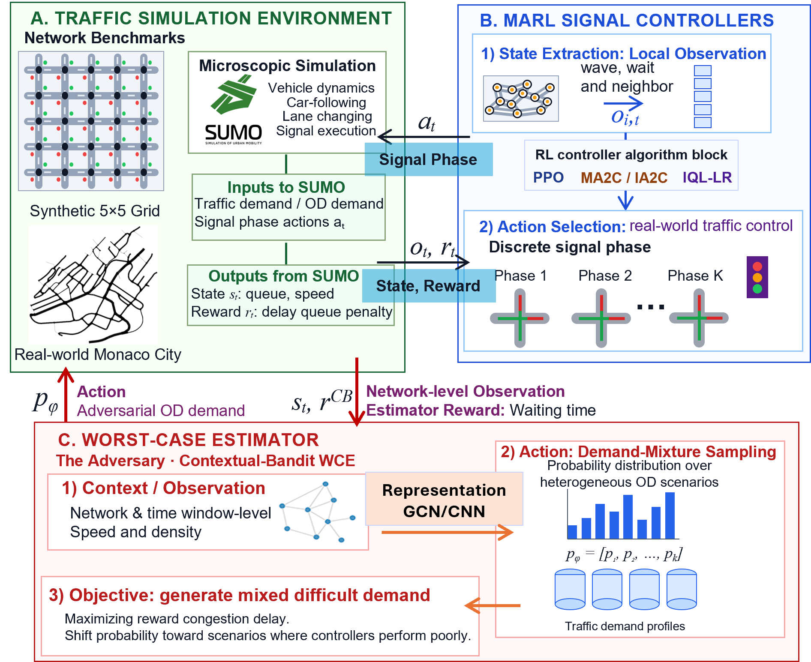
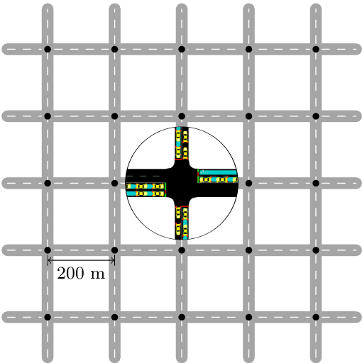
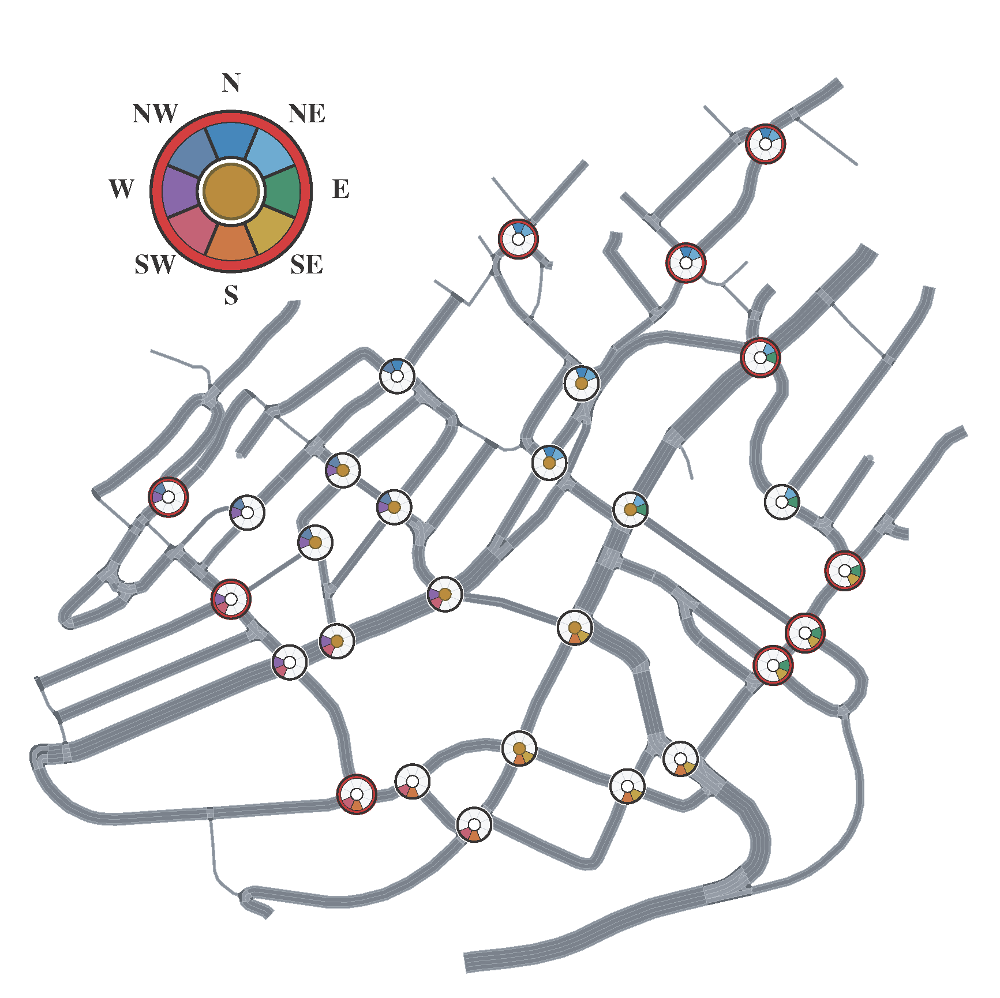
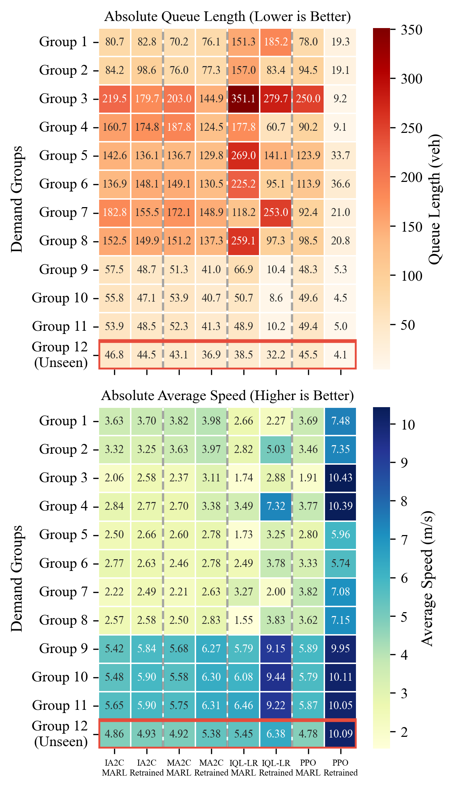
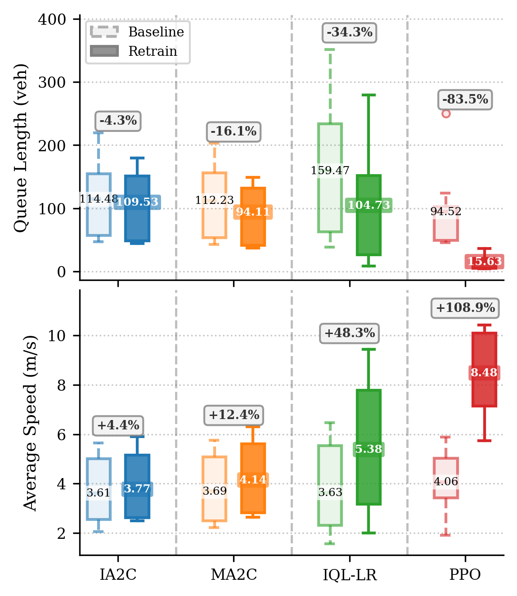
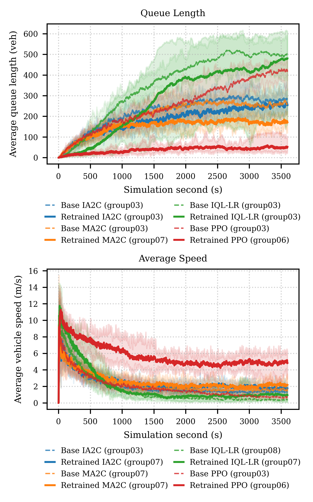
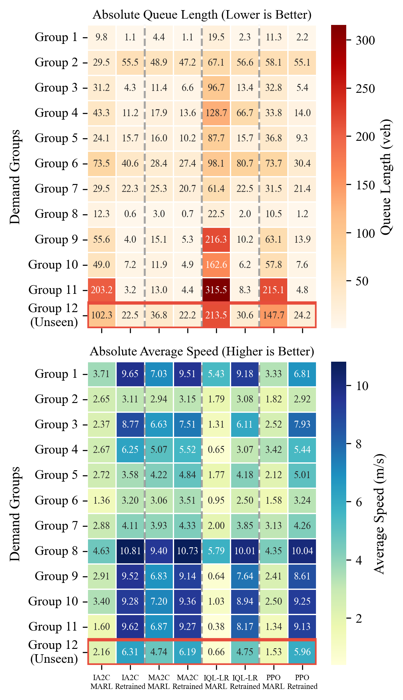
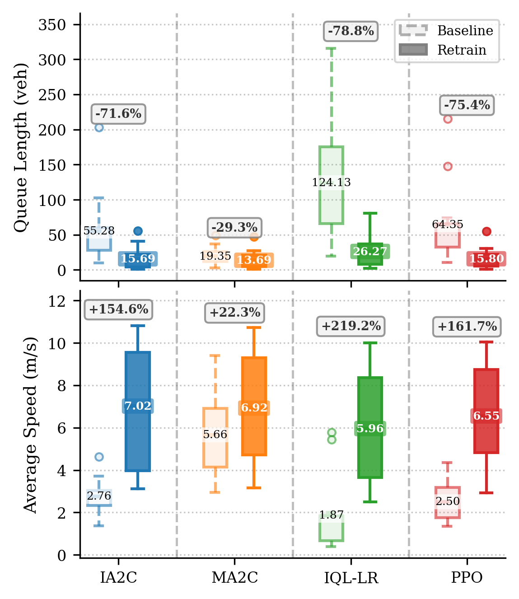
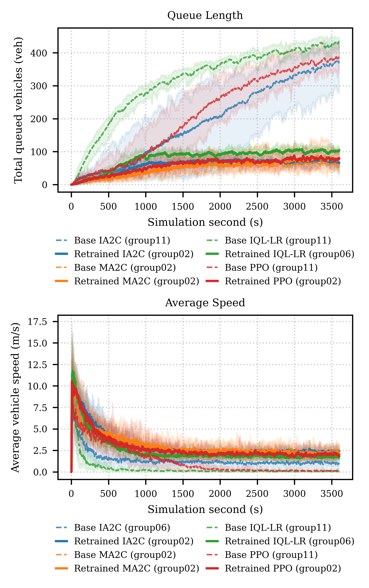

<h1 align="center">🚦 Distributionally Robust Multi-Agent Reinforcement Learning<br>for Intelligent Traffic Signal Control</h1>

<p align="center">
  <strong>A distributionally robust MARL framework for intelligent intersection control</strong><br>
  <sub><em>SUMO simulation · CB-WCE adversarial demand mixtures · worst-case traffic robustness</em></sub>
</p>

<p align="center">
  <a href="#project-video">🎬 Video</a> ·
  <a href="paper/A%20Distributionally%20Robust%20Multiagent%20Reinforcement%20Learning%20Framework%20for%20Intelligent%20Intersection%20Control.pdf">📄 Paper</a> ·
  <a href="#method-summary">🧠 Method</a> ·
  <a href="#results">📊 Results</a> ·
  <a href="#installation">⚙️ Installation</a> ·
  <a href="#reproducing-the-workflow">🚀 Reproduce</a>
</p>

<p align="center">
  <kbd>DR-MARL</kbd>
  <kbd>CB-WCE</kbd>
  <kbd>SUMO</kbd>
  <kbd>TensorFlow 1.x</kbd>
  <kbd>PPO / IA2C / MA2C / IQL</kbd>
</p>

This repository contains the implementation, experiments, figures, and paper
artifacts for:

**[A Distributionally Robust Multiagent Reinforcement Learning Framework for Intelligent Intersection Control](paper/A%20Distributionally%20Robust%20Multiagent%20Reinforcement%20Learning%20Framework%20for%20Intelligent%20Intersection%20Control.pdf)**


The project studies how multi-agent reinforcement learning (MARL) traffic
signal controllers fail under demand shifts, and how a Contextual-Bandit
Worst-Case Estimator (CB-WCE) can be co-trained with those controllers to
improve both worst-case robustness and average network performance.

<p align="center">
  
</p>

<p align="center">
  <em>Overall idea: a MARL traffic controller interacts with a SUMO traffic network, while a slower-timescale CB-WCE adversary adaptively selects demand mixtures that expose the controller's current vulnerabilities.</em>
</p>

<a id="project-video"></a>

## 🎬 Project Video

Click the thumbnail to watch the introduction video.

<p align="center">
  <a href="https://youtu.be/65iZHHfnw14?si=PMGZ296nrLfTWe8o">
    
  </a>
</p>

## 📌 Abstract

MARL is a promising approach for network-level traffic signal control, but
standard controllers usually optimize expected return under nominal traffic
conditions. This makes them vulnerable to spatial-temporal demand shifts,
rare high-load regimes, and bottleneck scenarios that can trigger queue
spillback or gridlock.

This work introduces an algorithm-agnostic DR-MARL framework that augments
existing MARL traffic controllers with a CB-WCE. The estimator operates at a
slower demand-window timescale and learns to generate adversarial mixtures of
traffic demand groups. During robust retraining, the traffic controller learns
under these dynamically selected hard scenarios, while the CB-WCE continues to
track the controller's evolving weak points.

The framework is evaluated on a synthetic 5x5 grid and a heterogeneous Monaco
City subnetwork, across value-based, actor-critic, and policy-gradient
controllers. The paper reports that robust retraining prevents unbounded queue
growth, improves average-case efficiency, improves worst-case robustness, and
shows promising zero-shot generalization to unseen demand distributions.

## ✨ Contributions

1. **Distributionally robust traffic-control training.** The repository
   implements a CB-WCE that adaptively reweights demand scenarios and co-evolves
   with MARL traffic controllers.
2. **Algorithm-agnostic integration.** The robust-training workflow supports
   IA2C, MA2C, PPO, IQL-DQN, and IQL-LR without changing the controller
   architectures.
3. **Evaluation across network complexity.** Experiments cover both a regular
   synthetic 5x5 grid and a real-world Monaco City subnetwork with irregular
   topology, heterogeneous phase sets, and non-uniform interaction structure.
4. **Worst-case and zero-shot analysis.** Evaluation includes 11 training
   demand groups plus an unseen Group 12 to test generalization beyond the
   training uncertainty set.

## 🚥 Traffic Signal Control Formulation

The traffic network is modeled as a decentralized MARL problem in SUMO. Each
signalized intersection is one agent. At decision step `t`, intersection `i`
observes local traffic features, selects a discrete signal phase, and receives
a local reward after the control interval.

| Component | 5x5 grid | Monaco subnetwork |
| --- | --- | --- |
| Controlled agents | 25 intersections | 30 signalized intersections |
| Action space | Shared five-phase signal plan for all agents | Intersection-specific phase sets due to heterogeneous geometry |
| Control interval | 5 s | 5 s |
| Safety handling | Yellow/all-red transition logic handled by SUMO environment | Yellow/all-red transition logic handled by SUMO environment |
| Local observation | Lane-level `wave` and `wait` | Lane-level `wave` only, to reduce noise in the irregular real network |
| Neighbor information | IA2C/PPO/IQL-LR use neighbor wave; MA2C also uses policy fingerprints | Same controller-specific pattern, with Monaco topology-specific neighbors |
| Reward | Negative queue length plus weighted waiting-time penalty (`a = 0.2`) | Negative queue length |

The controller families span the main algorithmic categories used in the
paper:

| Controller | Category | Role in the study |
| --- | --- | --- |
| IA2C | Independent actor-critic | Decentralized actor-critic baseline |
| MA2C | Multi-agent actor-critic | Adds neighbor states and policy fingerprints |
| PPO | Policy-gradient / actor-critic | Strong policy-gradient baseline and main qualitative video example |
| IQL-DQN | Value-based | Deep Q-learning variant |
| IQL-LR | Value-based with linear function approximation | Lightweight value-based baseline |

<a id="method-summary"></a>

## 🧠 Method Summary

Let \(K\) denote the number of representative traffic-demand scenarios. A
standard MARL controller seeks good expected performance over the training
distribution, but this can leave the worst scenario poorly controlled. This
project instead tracks both:

```text
Average performance:    J_avg(theta)   = (1 / K) sum_k J_k(theta)
Worst-case performance: J_worst(theta) = min_k J_k(theta)
```

The CB-WCE learns a policy over demand mixtures:

```text
w_tau in Delta^K,  sum_k w_tau,k = 1
lambda_mix(w_tau) = sum_k w_tau,k * lambda^(k)
```

At each demand window, the estimator observes a compact network-level
congestion summary, samples scenario weights, and injects the corresponding
mixed traffic demand into SUMO. The traffic controller then acts at the faster
signal-control interval and receives its standard reward. The CB-WCE receives a
network-level congestion reward and is updated to assign higher probability to
scenarios that are difficult for the current controller.

The adversary architecture follows the road topology:

| Network | CB-WCE representation | Rationale |
| --- | --- | --- |
| 5x5 grid | CNN actor-critic | Regular lattice topology supports spatial convolution over grid-like congestion features. |
| Monaco | GCN actor-critic | Irregular topology is better represented as a graph of signalized intersections. |

### 🧪 Three-Phase Training Protocol

| Phase | Purpose | Main scripts | Default scale in paper |
| --- | --- | --- | --- |
| I. Baseline MARL | Train traffic-light controllers under fixed demand-group cycling. | `main.py` | `1e6` environment steps |
| II. CB-WCE initialization | Freeze the controller and train an adversary to expose baseline weaknesses. | `train_adversary.py`, `train_adversary_real.py` | 500 episodes |
| III. DR retraining | Co-evolve controller and adversary under adaptive demand mixtures. | `train_coevolution.py`, `train_coevolution_real.py` | 1000 episodes |

The paper uses a control interval of 5 s and a demand-window duration of 600 s.
Each training episode cycles over 11 demand windows, yielding a 6600 s episode.

## 🗺️ Experimental Networks

The framework is evaluated on a controlled synthetic network and a real-world
urban network. The contrast is important: the 5x5 grid has homogeneous local
geometry, while the Monaco subnetwork contains heterogeneous lane counts,
turning structures, phase sets, and graph connectivity.

<table>
  <tr>
    <td align="center" width="50%">
      <br>
      <strong>Synthetic 5x5 Grid</strong><br>
      25 controlled intersections with regular topology and shared local phase logic.
    </td>
    <td align="center" width="50%">
      <br>
      <strong>Monaco City Subnetwork</strong><br>
      Real-world heterogeneous traffic network with directional, center, and periphery group labels.
    </td>
  </tr>
</table>

## 🚗 Demand Groups

The experiments define a finite uncertainty set of demand groups. Each demand
CSV uses:

```text
origin_edge
dest_edge
veh_per_hour
```

The 11 training groups cover directional corridor flows, diagonal flows,
center/periphery flows, and uniform demand:

```text
N_to_S, S_to_N, W_to_E, E_to_W,
NW_to_SE, SE_to_NW, SW_to_NE, NE_to_SW,
Periphery_to_Center, Center_to_Periphery, Uniform
```

The evaluation also includes an additional unseen Group 12. In the 5x5
experiment, this unseen demand is mapped from a Hangzhou scenario. In the
Monaco experiment, it corresponds to a real-life Monaco demand group.

5x5 demand files are stored in `data_traffic/`. Monaco demand files are stored
in `real_net_subnet/demand_groups/`.

<a id="results"></a>

## 📊 Results

The evaluation reports horizon-averaged queue length and average vehicle speed
over 10 independent rollouts. Lower queue length and higher speed indicate
better network operation.

### 🧱 5x5 Grid Results

Across the 5x5 grid experiments, DR retraining improves performance across
algorithms and strongly improves PPO. The paper reports that PPO's average
queue length drops by **83.46%** and its average speed increases by
**108.91%** after robust retraining.

Reported 5x5 improvements:

| Controller | Average queue reduction | Average speed improvement | Worst-case queue reduction | Worst-case speed improvement |
| --- | ---: | ---: | ---: | ---: |
| IA2C | 4.32% | 4.38% | 18.13% | 20.87% |
| MA2C | 16.15% | 12.42% | 26.64% | 19.00% |
| IQL-LR | 34.33% | 48.22% | 20.33% | 29.03% |
| PPO | 83.46% | 108.91% | 86.53% | 200.52% |

<p align="center">
  
  
</p>

<p align="center">
  <sub><strong>Left:</strong> horizon- and rollout-averaged queue length and speed across demand groups. <strong>Right:</strong> baseline versus DR-retrained controller distributions.</sub>
</p>

<p align="center">
  
</p>

<p align="center">
  <sub>5x5 grid: temporal evolution of worst-case queue length and speed over a 3600 s evaluation horizon. Groups 1-11 are training groups, and Group 12 is unseen.</sub>
</p>

### 🏙️ Monaco City Results

The Monaco experiment evaluates robustness under realistic network
heterogeneity. The paper reports that PPO robust retraining reduces average
queue length from 64.35 to 15.80 vehicles (**75.45% reduction**) and reduces
worst-case queue length from 215.10 to 55.08 vehicles (**74.39% reduction**).
For IQL-LR, the paper reports a **78.84%** average queue reduction and
**219.16%** average speed improvement.

Reported Monaco improvements:

| Controller | Average queue reduction | Average speed improvement | Worst-case queue reduction | Worst-case speed improvement |
| --- | ---: | ---: | ---: | ---: |
| IA2C | 71.62% | 154.55% | 72.70% | 128.68% |
| MA2C | 29.25% | 22.29% | 3.47% | 7.14% |
| IQL-LR | 78.84% | 219.16% | 74.41% | 557.89% |
| PPO | 75.45% | 161.74% | 74.39% | 141.79% |

<p align="center">
  
  
</p>

<p align="center">
  <sub><strong>Left:</strong> horizon- and rollout-averaged queue length and speed across demand groups. <strong>Right:</strong> baseline versus DR-retrained controller distributions.</sub>
</p>

<p align="center">
  
</p>

<p align="center">
  <sub>Monaco: temporal evolution of worst-case queue length and speed over a 3600 s evaluation horizon. Group 12 evaluates zero-shot generalization.</sub>
</p>

## 🎥 PPO Rollout Videos

The videos below provide qualitative comparisons of PPO before and after
DR retraining. Click any thumbnail to open the corresponding YouTube video.

<table>
  <tr>
    <td align="center" width="50%">
      <a href="https://youtu.be/Ahgr1z3DSA8?si=U8l5YwIGoaMHUiYz">
        
      </a><br>
      <strong>5x5 Baseline PPO</strong>
    </td>
    <td align="center" width="50%">
      <a href="https://youtu.be/qTtoakmXMo0?si=coNlA3I2RGJuV3j7">
        
      </a><br>
      <strong>5x5 DR-Retrained PPO</strong>
    </td>
  </tr>
  <tr>
    <td align="center" width="50%">
      <a href="https://youtu.be/mgMgB1uwveo?si=V-O0ZDno4ZtfGeoo">
        
      </a><br>
      <strong>Monaco Baseline PPO</strong>
    </td>
    <td align="center" width="50%">
      <a href="https://youtu.be/viNK5L7Saic?si=Z519MTCUKRCxle4n">
        
      </a><br>
      <strong>Monaco DR-Retrained PPO</strong>
    </td>
  </tr>
</table>

## 💡 Key Takeaways

- Standard average-case MARL can perform well on familiar traffic patterns but
  remains vulnerable to demand shifts.
- The identity of the worst-case demand group can change during robust
  retraining; keeping the adversary adaptive is therefore important.
- The CB-WCE improves robustness without modifying the underlying controller
  architecture.
- Robust retraining often improves average-case performance instead of merely
  trading average performance for worst-case safety.
- Zero-shot results suggest that training against hard demand mixtures can
  encourage more general traffic-clearing behavior.

## 🗂️ Repository Layout

```text
agents/                         MARL models, policies, buffers, and schedulers
config/                         Training and evaluation .ini files
data_traffic/                   5x5 demand groups and generator script
data_traffic_real/              Placeholder/legacy real-traffic data area
deeprl_signal_control/          Legacy nested output/log folder
demand_5x5_noisy/               Alternative/noisy 5x5 demand CSVs
envs/                           SUMO environment wrappers and adversarial envs
figs/                           Training figures used by reports/papers
large_grid/                     5x5 SUMO network files and route builders
output_adversary/               5x5 adversary checkpoints and logs
output_adversary_monaco/        Monaco adversary checkpoints and logs
output_coevolution/             5x5 robust retraining outputs
output_coevolution_real/        Monaco robust retraining outputs
output_result/                  Miscellaneous baseline outputs and examples
paper/                          Paper PDF, LaTeX source, and publication figures
real_net/                       Original Monaco SUMO network files
real_net_experimental_data/     Historical Monaco training/evaluation CSVs
real_net_subnet/                Monaco subnet network and demand groups
runs/                           Baseline controller runs and checkpoints
runs_eval/                      Benchmark outputs, plots, and raw CSVs
scripts/                        Utility shell scripts
small_grid/                     Small SUMO grid network files
```

Important entry points:

```text
main.py                         Baseline train/evaluate entry point
train_adversary.py              Train a 5x5 worst-case estimator
train_adversary_real.py         Train a Monaco worst-case estimator
train_coevolution.py            Co-evolutionary retraining on 5x5
train_coevolution_real.py       Co-evolutionary retraining on Monaco
eval_signal_controllers.py      5x5 benchmark evaluation
eval_signal_controllers_real.py Monaco benchmark evaluation
eval_signal_controller_visualize.py
                                 Single-controller SUMO GUI rollout
data_traffic/generate_5x5_demands.py
                                 5x5 demand-group generator
compute_horizon_averages_from_raw.py
                                 Post-process raw benchmark CSVs
plot_*.py, Worst_case_Multi_plot.py, boxplot_comparison_2in1.py
                                 Plotting and paper-figure helpers
```

<a id="installation"></a>

## ⚙️ Installation

This is a legacy TensorFlow/SUMO codebase. Linux, WSL, or macOS is recommended.
Run commands from the repository root.

Core requirements:

- Conda
- SUMO and SUMO tools
- TensorFlow 1.x style runtime
- `sumolib` and `traci`

Create the pinned Conda environment:

```bash
conda env create -f environment.yml
conda activate deeprlsc
```

Verify SUMO:

```bash
sumo --version
```

Set SUMO paths if they are not already configured:

```bash
export SUMO_HOME=/usr/share/sumo
export PYTHONPATH=$SUMO_HOME/tools:$PYTHONPATH
```

Helper scripts are included:

```bash
bash setup_env.sh
bash setup_ubuntu.sh
bash setup_mac.sh
```

There is no `requirements.txt` in the current repository. Use
`environment.yml` as the primary setup file.

<a id="reproducing-the-workflow"></a>

## 🚀 Reproducing the Workflow

### Stage I: Baseline Controller Training

Use `main.py` with the `train` subcommand. The global `--base-dir` option must
come before `train`.

PPO on the 5x5 grid:

```bash
python main.py --base-dir ./runs/ppo_large train \
  --config-dir ./config/config_ppo_large.ini \
  --test-mode no_test
```

IQL-LR on the Monaco subnet:

```bash
python main.py --base-dir ./runs/iqll_real train \
  --config-dir ./config/config_iqll_real.ini \
  --test-mode no_test
```

Common baseline configs:

```text
config/config_ia2c_large.ini
config/config_ma2c_large.ini
config/config_iqld_large.ini
config/config_iqll_large.ini
config/config_ppo_large.ini
config/config_ia2c_real.ini
config/config_ma2c_real.ini
config/config_iqld_real.ini
config/config_iqll_real.ini
config/config_ppo_real.ini
```

Outputs:

```text
runs/<agent>_<scenario>/log/
runs/<agent>_<scenario>/data/
runs/<agent>_<scenario>/model/checkpoint*
```

### Stage II: Train the Worst-Case Estimator

5x5 PPO adversary:

```bash
python train_adversary.py \
  --agent ppo \
  --frozen-config ./config/config_ppo_large.ini \
  --frozen-model-dir ./runs/ppo_large \
  --base-dir ./output_adversary/ppo_large \
  --total-episodes 500 \
  --checkpoint-interval-ep 5
```

Monaco PPO adversary:

```bash
python train_adversary_real.py \
  --agent ppo \
  --frozen-config ./config/config_ppo_real.ini \
  --frozen-model-dir ./runs/ppo_real \
  --base-dir ./output_adversary_monaco/ppo_real \
  --total-episodes 500 \
  --checkpoint-interval-ep 10
```

Resume an adversary run:

```bash
python train_adversary.py \
  --agent ppo \
  --base-dir ./output_adversary/ppo_large \
  --resume-checkpoint latest
```

### Stage III: Co-Evolutionary Robust Retraining

5x5 PPO co-evolution:

```bash
python train_coevolution.py \
  --agent ppo \
  --base-dir ./output_coevolution/ppo_large \
  --total-episodes 1000 \
  --checkpoint-interval-ep 10
```

Monaco PPO co-evolution:

```bash
python train_coevolution_real.py \
  --agent ppo \
  --base-dir ./output_coevolution_real/ppo \
  --frozen-config ./config/config_ppo_real.ini \
  --frozen-model-dir ./runs/ppo_real \
  --wce-dir ./output_adversary_monaco/ppo_real \
  --total-episodes 1000 \
  --checkpoint-interval-ep 10
```

Outputs:

```text
output_coevolution/<agent>_large/log/
output_coevolution/<agent>_large/data/
output_coevolution/<agent>_large/model_traffic/checkpoint*
output_coevolution/<agent>_large/model_adversary/checkpoint*

output_coevolution_real/<agent>/log/
output_coevolution_real/<agent>/data/
output_coevolution_real/<agent>/model_traffic/checkpoint*
output_coevolution_real/<agent>/model_adversary/checkpoint*
```

## ✅ Evaluation Commands

Evaluate run folders with `main.py`:

```bash
python main.py --base-dir ./runs evaluate \
  --agents ppo_large \
  --evaluation-policy-type deterministic
```

Benchmark 5x5 controllers:

```bash
python eval_signal_controllers.py \
  --demand-dir ./data_traffic \
  --output-dir ./runs_eval/signal_controller_benchmark \
  --num-rollouts 10 \
  --group-duration-sec 3600
```

Benchmark Monaco controllers:

```bash
python eval_signal_controllers_real.py \
  --demand-dir ./real_net_subnet/demand_groups \
  --output-dir ./runs_eval/signal_controller_benchmark_real \
  --num-rollouts 10 \
  --group-duration-sec 3600
```

Visualize one rollout in SUMO GUI:

```bash
python eval_signal_controller_visualize.py \
  --controller ppo_marl \
  --group demand_Uniform
```

Use `--no-gui` for a headless rollout and `--list-options` to print available
controllers and demand groups.

## 🛠️ Development Notes

- Run scripts from the repository root so relative paths resolve correctly.
- `tf_compat.py` routes TensorFlow imports through `tensorflow.compat.v1` when
  available.
- SUMO control uses ports starting at `8000`; parallel runs use port offsets.
- TensorFlow checkpoints are saved as `checkpoint-*` files. The saver keeps the
  latest five checkpoints by default.
- Many large run outputs and trained checkpoints are already present. Use a
  fresh output directory for new experiments to avoid mixing results.

## 📚 Citation

If you use this code or reproduce the results, please cite the associated
[paper](paper/A%20Distributionally%20Robust%20Multiagent%20Reinforcement%20Learning%20Framework%20for%20Intelligent%20Intersection%20Control.pdf):

```bibtex
@article{pei2026drmarltraffic,
  title  = {A Distributionally Robust Multiagent Reinforcement Learning Framework for Intelligent Intersection Control},
  author = {Pei, Shuwei and Borger, Joran and Kosay, Arda and Jayawardhana, Bayu and Sayin, Muhammed O. and Ahmed, Saeed},
  year   = {2026}
}
```

## 📄 License

This repository includes an MIT license. See `LICENSE` for the full text.
