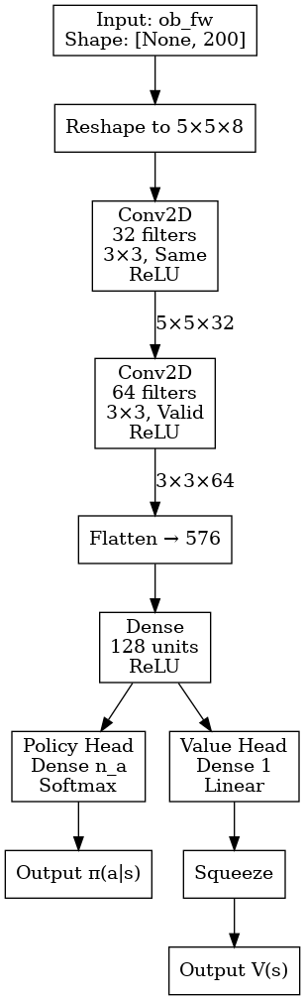

## 🛠 GitHub Quick Start Guide

This guide covers the basic workflow for managing the `updated_worst_case_MARL` repository on Windows.

### 1. Prerequisites

For Windows users, download and install **Git** from [git-scm.com](https://git-scm.com/). During installation, ensure you enable **Git Bash**, which will be your primary terminal for these commands.

### 2. Initial Setup: Cloning the Repository

To "fork" (copy) the project onto your local machine, open Git Bash and run:

```bash
# Navigate to the directory where you want the folder to live
cd /path/to/your/folder

# Clone the repository
git clone https://github.com/TravidP/updated_worst_case_MARL.git

```

---

### 3. Syncing: Pulling Online Changes to Local

If the code on GitHub has been updated and you want to bring those changes to your computer:

```bash
git pull origin main

```

---

### 4. Contributing: Pushing Local Changes to GitHub

To upload your local work to the online repository, follow these steps in order:

1. **Navigate** to your project folder:
```bash
cd updated_worst_case_MARL
```


2. **Check** what has changed:
```bash
git status
```


3. **Stage** the changes:
```bash
git add .
```


4. **Commit** with a descriptive message:
```bash
git commit -m "Update: Describe your changes here"
```


5. **Push** to the cloud:
```bash
git push origin main
Use your username (`TravidP`)
Access --  you can check the password in shared google slides.
```

---
Here is a polished and professional version of your Markdown. I’ve refined the technical phrasing, corrected the spelling of "Monaco" and "regional," and organized the information for better readability.

---

# 📊 Traffic Distribution Profiles

This section details the traffic demand generation for both the synthetic 5x5 grid and the Monaco real-world network, as provided by Arda.

## 1. Data Format

All traffic distributions are stored as **CSV files**. Each file defines the flow using the following parameters:

* `origin_edge`: Starting edge of the trip.
* `dest_edge`: Destination edge of the trip.
* `veh_per_hour`: Flow rate (volume).
* **Hard-coded Routes:** Specifically for the Monaco scenario, routes are pre-defined to match the real-city topology.

---

## 2. 5x5 Large Grid Network

The synthetic 5x5 grid distributions are located in `./data_traffic/`.

* **Generation Script:** You can regenerate or modify the demand using:
`./data_traffic/generate_5x5_demands.py`
* **Current Settings:** The total demand is currently set to **1,000 veh/h**.
* **Debugging:** This level of demand is relatively low (less congested). Use the GUI visualization to verify the flow. If the network remains under-saturated, increase the demand parameters within the generation script.

---

## 3. Monaco Real-World Network

Traffic distributions for the Monaco network are currently under development. Unlike the 5x5 grid, these focus on **Regional Pairs** rather than simple Origin-Destination (OD) pairs. It will be located in `./data_traffic_real/`.

### Methodology:

* **Regional Pairing:** Based on the source paper, the network is divided into **4 specific regions**.
* **OD Generation:** Instead of random points, we select 1 or 2 regional pairs (e.g., *Region F1* to *Region F2*) and generate OD pairs specifically between those clusters.
* **Routing:** All vehicle routes are **hard-coded** in advance to ensure consistency with the established research paper's methodology.


 

---

# 🚦 5x5 Large Grid: Visualization & Training Guide

This guide details the procedures for enabling the GUI for debugging, configuring multi-stage training, and implementing adversarial co-evolution for the **5x5 Large Grid Map**.

---

## 1. Enabling Visualization (Debugging)

To observe the simulation in real-time during debugging, modify the environment initialization in the source code.

**File:** `./envs/env.py`

* **For Debugging:** Set `gui=True` to launch the SUMO visualizer.
* **For Training:** Comment out the manual override to disable the GUI, which significantly reduces memory overhead and increases training speed.

```python
# Line 555-556
self._init_sim(seed, gui=True)  # Enable for real-time visualization
# self._init_sim(seed, gui=gui) # Standard setting for headless training

```

---

## 2. Stage I: Initial Traffic Controller Training

This project supports several RL algorithms: **IA2C, MA2C, IQLL, and IQLD**. Model architectures and policies are located in `./agents/models` and `./agents/policies`. 

### Training Command

Use the following template to initialize training:

```bash
python main.py --base-dir [base_dir]/[agent] train --config-dir [config_dir] --test-mode no_test

```

**Example (IA2C on Large Grid):**

```bash
python main.py --base-dir ./runs/ia2c_large train --config-dir ./config/config_ia2c_large.ini --test-mode no_test

```

> **Note on Checkpoints:** Models are saved every **10,000 steps**. By default, only the 5 most recent models are retained in `./runs`. This frequency can be adjusted in `utils.py` around line 290.

---

### Traffic Distribution & Scenario Duration

The controller automatically pulls traffic distribution profiles from `./data_traffic/`.

* **Sequential Training:** The agent trains across different traffic distribution groups in sequence.
* **Default Duration:** Each group runs for a **600-second (10-minute)** window.

**Adjusting Simulation Length:**
If the 5x5 grid requires more time for agents to clear the network, extend the `SCENARIO_DURATION`.
**File:** `./env/large_grid_env.py`

```python
# Line 24
SCENARIO_DURATION = 600  # Extended to 20 minutes for larger grids

```

---

### Hyperparameter Tuning

Key parameters can be adjusted within your specific `.ini` config file:

| Parameter | Recommended | Description |
| --- | --- | --- |
| `total_step` | `1e6` | Total timesteps for the training run. |
| `batch_size` | `120` | Number of samples per policy update. |

---

## 3. Stage II: Adversarial "Worst Estimator" Training

To train an adversary that identifies the most challenging traffic conditions, use `train_adversary.py`. This script utilizes the `AdversarialLargeGridEnv` from `./envs/adversarial_large_grid_env.py`.

### Configuration

1. **Select Target Model:** In `train_adversary.py` (Lines 140-141), specify the frozen traffic controller you wish to attack:
```python
FROZEN_CONFIG_PATH = './config/config_iqll_large.ini'
FROZEN_MODEL_DIR = './runs/iqll_large' 

```


2. **Output Path:** Define a unique directory for the adversary's progress (Line 135):
```python
base_dir = './output_adversary/ia2c_large'

```


### Training Mechanics

* **Adversary Logic:** The adversary selects weights for traffic groups every 10 minutes (600s).
* **Reward Function:** The adversary receives the negative sum of step rewards (). Its goal is to **maximize delay/congestion**.
* **Model Architecture:** The adversary uses a **CNN-A2C** structure in './agents/models', './agents/policies'.  
* **Intervals:** Checkpoints are saved every 10 episodes (Line 230). Policy updates begin after a batch size of 120 is reached. Total training is set to **500 episodes** (Line 183) in `train_adversary.py`.

---

## 4. Stage III: Co-evolutionary Retraining

The final stage involves retraining the traffic controller against the adversarial traffic distributions using `train_coevolution.py`. This script utilizes the `CoevolutionLargeGridEnv` from `./envs/coevolution_env.py`.

### Execution

```bash
python train_coevolution.py

```

### Setup Instructions

1. **Define Directories:** In `train_coevolution.py` (Line 81), set your output path:
```python
base_dir = './output_coevolution/ia2c_large'

```


2. **Link Checkpoints:** Point the script to your previously trained adversary and original traffic controller (Lines 86-88):
```python
ADVERSARY_CHECKPOINT_DIR = './output_adversary/'     
TRAFFIC_CHECKPOINT_DIR = './runs/ia2c_large/model/'  
CONFIG_FILE = './config/config_ia2c_large.ini'

```


3. **Duration:** Training lasts for **1000 episodes**. The adversary updates its traffic weight combination every 600 seconds (Lines 152-153) In `train_coevolution.py`.

---


# 🚦 Monaco real city: Training Guide


## 1. Stage I: Initial Traffic Controller Training

This project supports several RL algorithms: **IA2C, MA2C, IQLL, and IQLD**. Model architectures and policies are located in `./agents/models` and `./agents/policies`. 

### Training Command

Use the following template to initialize training:

```bash
python main.py --base-dir [base_dir]/[agent] train --config-dir [config_dir] --test-mode no_test

```

**Example:**

```bash
python main.py --base-dir ./runs/ia2c_real train --config-dir ./config/config_ia2c_real.ini --test-mode no_test

```

> **Note on Checkpoints:** Models are saved every **10,000 steps**. By default, only the 5 most recent models are retained in `./runs`. This frequency can be adjusted in `utils.py` around line 290.

---


The controller automatically pulls traffic distribution profiles from `./data_traffic_real/`. *** Right now, we do not have the Monaca data from Arda. We are waiting for him to generate the data group for Monaca real city. ***

* **Sequential Training:** The agent trains across different traffic distribution groups in sequence.
* **Default Duration:** Each group runs for a **600-second (10-minute)** window.

**Adjusting Simulation Length:**
If the it requires more time for agents to clear the network, extend the `SCENARIO_DURATION`.
**File:** `./env/real_net_env.py`

```python
# Line 22
SCENARIO_DURATION = 600  # Extended to 20 minutes for larger grids

```

---

Key parameters can be adjusted within your specific `.ini` config file:

| Parameter | Recommended | Description |
| --- | --- | --- |
| `total_step` | `1e6` | Total timesteps for the training run. |
| `batch_size` | `40` | Number of samples per policy update. |

---

## 2. Stage II: Adversarial "Worst Estimator" Training

To train an adversary that identifies the most challenging traffic conditions, use `train_adversary_real.py`. This script utilizes the `AdversarialRealNetEnv` from `./envs/adversarial_real_net_env.py`.

### Configuration

1. **Select Target Model:** In `train_adversary_real.py` (Lines 47-48), specify the frozen traffic controller you wish to attack:
```python
    FROZEN_CONFIG_PATH = './config/config_ia2c_real.ini' # Use Monaco Config
    FROZEN_MODEL_DIR = './runs/ia2c_real' # Path to trained IA2C on Monaco

```


2. **Output Path:** Define a unique directory for the adversary's progress (Line 42):
```python
    base_dir = './output_adversary_monaco/ia2cxxx'

```


### Training Mechanics

* **Adversary Logic:** The adversary selects weights for traffic groups every 10 minutes (600s).
* **Reward Function:** The adversary receives the negative sum of step rewards (). Its goal is to **maximize delay/congestion**.
* **Model Architecture:** The adversary uses a **GCN-A2C** structure in './agents/models', './agents/policies'. 
* **Intervals:** Checkpoints are saved every 10 episodes (Line 230). Policy updates begin after a batch size of 120 is reached. Total training is set to **500 episodes** (Line 183) in `train_adversary_real.py`. if it is not enough we can extend the training episodes.

---

## 3. Stage III: Co-evolutionary Retraining

The final stage involves retraining the traffic controller against the adversarial traffic distributions using `train_coevolution_real.py`. This script utilizes the `CoevolutionRealNetEnv` from `./envs/coevolution_real_net_env.py`.

### Execution

```bash
python train_coevolution_real.py

```

### Setup Instructions

1. **Define Directories:** In `train_coevolution_real.py` (Line 50), set your output path:
```python
base_dir = './output_coevolution_real/ia2c_large'

```


2. **Link Checkpoints:** Point the script to your previously trained adversary and original traffic controller (Lines 16-18):
```python
# --- PATH CONFIGURATION ---
FROZEN_CONFIG_PATH = './config/config_ia2c_real.ini'
FROZEN_MODEL_DIR = './runs/ia2c_real'
WORST_CASE_ESTIMATOR_DIR = './output_adversary_monaco/'

```


3. **Duration:** Training lasts for **1000 episodes**. The adversary updates its traffic weight combination every 600 seconds (Lines 95) In `train_coevolution_real.py`.

---