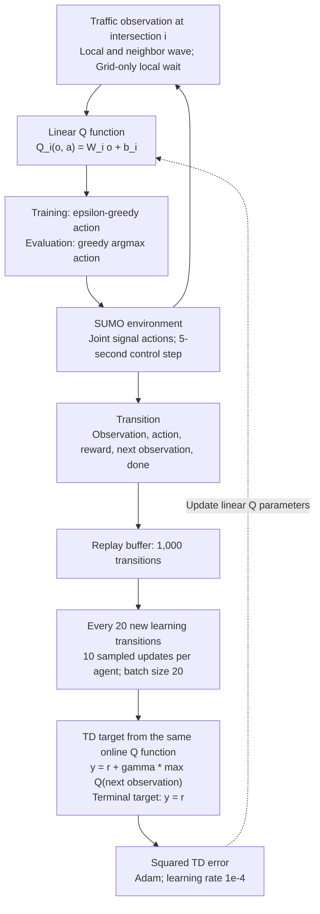
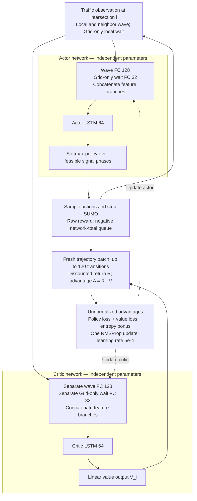
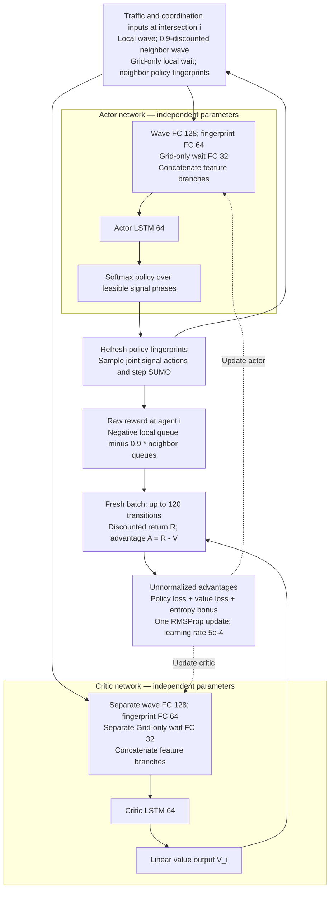
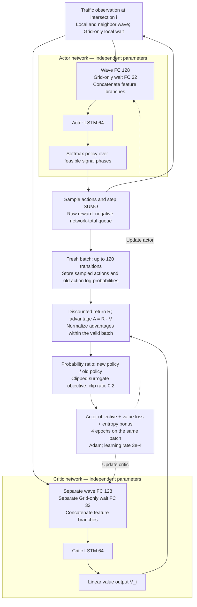

# Why Does WCE Co-evolution Benefit PPO More? A Local Experimental Diagnosis

Date: 2026-10-06  
Scope: Protocol v7, training seed 101, Grid + Monaco, 40 selected final controllers, 9,200 evaluation rollouts.  
Status: Local diagnostic report; not a substitute for the formal Phase F release audit.

## 1. Direct answer

The evidence supports a strong match between PPO and this particular WCE configuration, rather than exclusive usefulness of WCE for PPO or purely random outcomes for the other controllers. PPO online WCE has the lowest mean queue in all 12 test scenarios in each network, both within PPO and across all 20 controller–method combinations. On seen scenarios, however, it wins only 6/11 in Grid and 5/11 in Monaco.

The other controllers show structured preferences: IA2C often favors broader domain randomization or the original curriculum; MA2C often favors random single-profile training, with WCE weaknesses appearing under Monaco peak extrapolation; fixed WCE helps IQLL in some Grid scenarios, while online adaptation often hurts. The leading explanation is the interaction between update stability, advantage normalization, repeated use of fresh data, and curriculum coverage. Training logs additionally show pronounced adversarial concentration for Grid IA2C and low exploration during IQLL continuation. These are supported mechanisms to investigate, not established causal explanations.

## 2. Sources, definitions, and limits

\[
Q(t)=\sum_{l\in L_{\mathrm{controlled}}}q_l(t),\qquad
J_Q=\frac{1}{3600}\sum_{t=1}^{3600}Q(t).
\]

The Grid browser value for IA2C baseline in the first scenario was 60.28, matching the workspace mean of 60.2818.

The requested browser page still displayed a 4,600-rollout Grid-only snapshot. The workspace registry, release metadata, and CSVs include both networks, with 4,600 rollouts each. This report uses the workspace CSVs, with a directly checked Grid value matching the browser; Monaco is a local-data extension, not a claim about the browser's displayed snapshot.

Grouped means were reconciled against all 9,200 rollout records, and demand hashes plus arrival/SUMO seeds were checked across the 20 combinations for each paired evaluation index. Training manifests were resolved through the exact evaluation suite checkpoint paths; all 40 selected final controllers are complete at 2,320,000 learning steps. The primary metric is the time-averaged network-total queue over deduplicated controlled approach lanes, not queue per intersection. Scenario means are equally weighted within each split. Worst and worst-3 operate on scenario means, not instantaneous peaks.

The queue unit is vehicles, with lower values better. Each scenario has ten evaluation rollouts. There are eleven seen and twelve test scenarios, equally weighted within each split. The equations above define the primary metric.

**Shared limitations:**

- Only one training seed, 101, is available. Ten evaluation rollouts do not represent ten independent training runs.
- Bootstrap intervals reflect evaluation variability conditional on frozen checkpoints and the fixed scenario suite, not training-seed uncertainty or population-level algorithm significance.
- The selected Grid IA2C, MA2C, and PPO baselines used Python 3.10.12 / TensorFlow 2.15.1. Grid IQLL baseline, all Monaco baselines, and the selected other continuations used Python 3.6.13 / TensorFlow 1.12.0. Runtime confounding therefore affects three Grid baseline comparisons specifically and precludes strict training-speed fairness claims.
- Current `agents/controller.py`, `agents/wce.py`, `agents/policies.py`, `experiments/runner.py`, and `envs/experiment_env.py` match source hashes in the selected Grid PPO online manifest; `experiments/core.py` does not. Reward interpretation combines current code, the workbook, and actual reward logs. The current repository is not an entirely identical historical source snapshot.
- No retraining, SUMO simulation, or formal release validation was performed. Result reconciliation is not formal publication certification.

## 3. Main quantitative findings

All tables use unsmoothed measurements.

### Mean queue across 12 test scenarios

| Network | Controller | baseline | random group | domain randomization | fixed WCE | online WCE |
| --- | --- | ---: | ---: | ---: | ---: | ---: |
| Grid | IA2C | 80.15 | 79.58 | **75.95** | 81.75 | 90.94 |
| Grid | MA2C | 69.51 | **67.07** | 67.76 | 69.67 | 69.58 |
| Grid | IQLL | 117.48 | 106.25 | 112.13 | **106.10** | 148.72 |
| Grid | PPO | 62.98 | 50.91 | 26.23 | 32.22 | **23.46** |
| Monaco | IA2C | 103.30 | 166.83 | **96.82** | 115.83 | 107.59 |
| Monaco | MA2C | 21.93 | **20.75** | 24.23 | 31.69 | 29.90 |
| Monaco | IQLL | 285.80 | **184.49** | 266.27 | 277.60 | 275.88 |
| Monaco | PPO | 117.34 | 178.35 | 19.83 | 28.29 | **13.18** |

### Mean queue across 11 seen scenarios

| Network | Controller | baseline | random group | domain randomization | fixed WCE | online WCE |
| --- | --- | ---: | ---: | ---: | ---: | ---: |
| Grid | IA2C | 100.09 | **89.17** | 107.49 | 115.22 | 117.12 |
| Grid | MA2C | 92.35 | **90.24** | 100.66 | 103.65 | 103.74 |
| Grid | IQLL | 242.75 | **164.92** | 190.13 | 174.14 | 244.21 |
| Grid | PPO | 92.81 | 60.89 | 44.52 | 58.33 | **41.86** |
| Monaco | IA2C | **52.74** | 69.95 | 57.02 | 62.02 | 56.16 |
| Monaco | MA2C | **22.14** | 22.28 | 23.91 | 28.74 | 24.86 |
| Monaco | IQLL | 155.07 | **94.89** | 128.35 | 143.21 | 133.86 |
| Monaco | PPO | 52.67 | 68.95 | 24.61 | 31.68 | **20.72** |

### Number of test-scenario wins within each controller

| Network | Controller | baseline | random group | domain randomization | fixed WCE | online WCE |
| --- | --- | ---: | ---: | ---: | ---: | ---: |
| Grid | IA2C | 2 | 2 | 8 | 0 | 0 |
| Grid | MA2C | 0 | 4 | 8 | 0 | 0 |
| Grid | IQLL | 3 | 2 | 0 | 7 | 0 |
| Grid | PPO | 0 | 0 | 0 | 0 | 12 |
| Monaco | IA2C | 4 | 0 | 7 | 1 | 0 |
| Monaco | MA2C | 0 | 7 | 3 | 0 | 2 |
| Monaco | IQLL | 0 | 12 | 0 | 0 | 0 |
| Monaco | PPO | 0 | 0 | 0 | 0 | 12 |

### Test tail performance

Each cell is worst / worst-3 in vehicles; lower is better.

| Network | Controller | baseline | random group | domain randomization | fixed WCE | online WCE |
| --- | --- | ---: | ---: | ---: | ---: | ---: |
| Grid | IA2C | 134.49 / 114.80 | 122.54 / 111.20 | 119.57 / 106.08 | 128.33 / 119.22 | 151.01 / 133.83 |
| Grid | MA2C | 102.64 / 92.64 | 100.99 / 88.00 | 101.64 / 91.80 | 104.62 / 96.52 | 104.88 / 97.21 |
| Grid | IQLL | 471.41 / 252.45 | 234.35 / 173.85 | 446.85 / 254.36 | 289.13 / 252.58 | 420.17 / 251.94 |
| Grid | PPO | 138.29 / 97.11 | 84.54 / 66.85 | 36.26 / 34.32 | 55.47 / 44.45 | 32.99 / 29.65 |
| Monaco | IA2C | 205.10 / 178.98 | 252.73 / 242.03 | 209.67 / 181.44 | 222.84 / 205.08 | 213.41 / 187.87 |
| Monaco | MA2C | 55.59 / 36.11 | 46.30 / 32.54 | 85.31 / 46.70 | 122.51 / 67.77 | 110.16 / 65.43 |
| Monaco | IQLL | 341.16 / 339.67 | 242.89 / 236.74 | 323.10 / 319.33 | 323.16 / 321.04 | 318.05 / 314.83 |
| Monaco | PPO | 214.78 / 190.40 | 261.13 / 250.21 | 63.13 / 46.59 | 127.44 / 83.32 | 45.25 / 28.56 |

### Paired test-suite differences

Differences are online WCE minus comparator, in vehicles; negative favors online. Equally average the twelve scenarios at each rollout index, then perform 10,000 percentile bootstrap resamples of the ten paired differences. Seeds are derived from stable SHA-256 labels. These are conditional 95% evaluation intervals, not training-seed uncertainty; no multiple-testing inference is made.

| Network | Controller | vs baseline: delta [95% CI] | vs domain randomization | vs fixed WCE |
| --- | --- | ---: | ---: | ---: |
| Grid | IA2C | +10.78 [+9.32, +12.32] | +14.99 [+13.11, +16.80] | +9.19 [+7.56, +10.87] |
| Grid | MA2C | +0.07 [-0.48, +0.71] | +1.82 [+1.45, +2.18] | -0.09 [-0.38, +0.24] |
| Grid | IQLL | +31.24 [+26.04, +36.16] | +36.59 [+32.01, +41.03] | +42.62 [+34.37, +50.20] |
| Grid | PPO | -39.53 [-42.29, -37.20] | -2.77 [-2.94, -2.58] | -8.76 [-9.17, -8.43] |
| Monaco | IA2C | +4.29 [+0.41, +8.77] | +10.78 [+6.60, +15.82] | -8.24 [-15.06, -1.15] |
| Monaco | MA2C | +7.98 [+5.57, +10.39] | +5.67 [+2.25, +8.84] | -1.79 [-4.80, +1.64] |
| Monaco | IQLL | -9.92 [-12.60, -7.18] | +9.61 [+7.48, +11.84] | -1.73 [-4.50, +1.05] |
| Monaco | PPO | -104.16 [-110.07, -98.61] | -6.65 [-9.57, -4.19] | -15.11 [-18.07, -12.18] |

### 3.1 Patterns supported by the data

**PPO:** Gains are consistent, but broad mixture training explains a substantial fraction. Test mean queue changes from 62.98 to 26.23 to 23.46 in Grid, and 117.34 to 19.83 to 13.18 in Monaco, for baseline, domain randomization, and online WCE. Online improves over baseline by 62.76%/88.77%, but its incremental reduction over domain randomization is 10.57%/33.53%. The total gain should not be attributed entirely to adaptive adversarial search.

**IA2C:** Online WCE beats baseline in only 2/23 Grid scenarios and never wins among the five methods there; domain randomization wins 8/12 Grid and 7/12 Monaco test scenarios. Monaco online test queue is 4.16% worse than baseline, although it improves over fixed WCE and random grouping. Improving one comparator is different from being the best method overall.

**MA2C:** Small overall differences hide scenario-family structure. Grid online differs from baseline by only +0.067 vehicles, with an interval crossing zero; the fixed comparison also crosses zero. Peak and redistribution improve while mixture and temporal performance deteriorate. In Monaco peak 1.50, queues are 46.30 for random grouping, 55.59 baseline, 85.31 DR, 110.16 online, and 122.51 fixed. Online averages 14.12 on mixtures but 62.57 on peaks. This suggests a mixture-training versus intensity-extrapolation tradeoff.

**IQLL:** Fixed and online WCE have different effects. Grid fixed wins 7/12 test scenarios, especially peaks and redistribution: at peak 1.50 it yields 52.10 versus online 175.47 and baseline 93.58. Yet its mixture-family mean is 152.87 versus baseline 83.15. Grid online lowers the worst scenario mean from 471.41 to 420.17 while worsening the test average from 117.48 to 148.72. Monaco random grouping wins all 12 test scenarios; online modestly improves over baseline but remains 91.39 vehicles worse than random grouping.

## 4. What differs in the implemented training?

### 4.1 Budget and curriculum

| Item | Verified setting |
| --- | --- |
| Parent | 1,000,000 controller learning steps |
| Offline WCE | 500 episodes, controller frozen |
| Continuation | 1,000 episodes × 1,320 steps = 1,320,000 learning steps |
| Final controller | 2,320,000 learning steps for all five methods |
| Episode | 6,600 s; 5-s control; 11 demand windows × 600 s |
| baseline | fixed ordered one-profile curriculum |
| random_group | random one-hot profile, repetitions and omissions allowed |
| domain_randomization | fresh Dirichlet mixture per window |
| fixed_wce | frozen parameters, state-dependent stochastic weights |
| online_wce | same pretrained adversary, continuing joint adaptation |

Fixed WCE freezes network parameters, not demand weights. State and Gaussian sampling still vary. WCE samples eleven Gaussian logits and maps them through softmax. Each controller has its own adversary trained against its parent, so cross-controller comparisons also involve different curricula.

### 4.2 Optimization and representation

| Setting | PPO | IA2C | MA2C | IQLL |
| --- | --- | --- | --- | --- |
| Controller | Separate actor/critic: LSTM 64, wave FC 128; Grid-only wait FC 32 | same | Separate actor/critic + neighbor fingerprints FC 64 | Linear Q; no recurrent state |
| Optimizer | Adam | RMSProp | RMSProp | Adam |
| Learning rate | 3e-4 constant | 5e-4 constant | 5e-4 constant | 1e-4 constant |
| Advantage normalization | true | false | false | N/A |
| Batch | 120 transitions | 120 | 120 | 20 sampled replay transitions |
| Updates | 4 epochs per fresh batch | 1 per fresh batch | 1 per fresh batch | every 20 new transitions, 10 updates per agent |
| PPO clip ratio | 0.2 | N/A | N/A | N/A |
| Exploration | entropy coefficient 0.01 | 0.01 | 0.01 | epsilon 1.0 → 0.01 over 500,000 learning steps |
| Reward norm Grid / Monaco | 3000 / 1000 | 3000 / 1000 | 2000 / 200 | 3000 / 1000 |

All controllers use gamma 0.99, reward clipping ±2, and gradient norm cap 40. A 120-step on-policy batch coincides with the 600-second demand window. PPO performs four optimization epochs per agent per batch versus one for A2C. IQLL's 1,000-transition replay spans roughly 5,000 seconds or 8.33 demand windows. Its bootstrap target uses the same online Q function, without a separate target network or Double-Q branch. These facts concern the implemented `Controller` path used by the selected runs.

### 4.3 The adversary is not a purely one-window bandit

WCE uses gamma 1.0, episode-level returns over eleven windows, and a value baseline, with one parameter update per episode. Offline training contributes 500 updates and online continuation another 1,000. Demand decisions occur every 600 seconds, but adversary parameter updates every 6,600 seconds. Earlier decisions receive credit for later congestion and carry-over traffic. The Gaussian-logit entropy bonus does not directly constrain simplex-weight entropy or guarantee profile coverage.

### 4.4 Architecture and training diagrams

These diagrams describe the local implementation used by this project; they are original schematics, not reproductions of paper figures. Each intersection has its own controller. Solid arrows show inference or experience flow; dashed arrows show training updates. Layer sizes are taken from the revised configurations.

**Input distinction:** Grid uses wave and local wait features; Monaco uses wave features only. The wait branch below is therefore present only in Grid. Wave inputs include local and immediate-neighbor measurements. MA2C additionally uses neighbor policy fingerprints and discounts neighbor wave inputs by 0.9. Actor and critic have independent FC/LSTM parameters and independent recurrent states.

#### IQLL — Independent Q-Learning with Linear Regression



**Key distinction:** This implementation has no LSTM, separate actor, separate critic, or target network. Epsilon decreases from 1.0 to 0.01 over 500,000 learning steps and is already at its floor during continuation.

#### IA2C — Independent Advantage Actor–Critic



**Key distinction:** IA2C uses independent recurrent actor and critic networks without neighbor-policy fingerprints. Reward normalization/clipping occurs before learning. A full 120-transition batch spans one 600-second demand window; terminal partial batches are masked.

#### MA2C — Multi-Agent Advantage Actor–Critic



**Key distinction:** MA2C adds explicit neighbor-policy information and a local-plus-neighbor reward. It remains decentralized: the figure does not imply a centralized critic, shared agent parameters, or a single global actor.

#### PPO — Proximal Policy Optimization with Local LSTM Controllers



**Key distinction:** Local PPO and IA2C have the same network architecture and observation types. Their main differences are the learning objective, advantage normalization, optimizer, learning rate, and number of epochs. This implementation computes discounted returns rather than GAE; old log-probabilities remain fixed throughout all four epochs, and every epoch starts from the same batch-start recurrent state.

**Source mapping:** Local [controller construction and updates](../../agents/controller.py), [FC/LSTM feature branches](../../agents/recurrent.py), [independent actor/critic networks and linear Q](../../agents/policies.py), [state assembly](../../envs/env.py), [Grid feature selection](../../envs/large_grid_env.py), and [Monaco feature selection](../../envs/real_net_env.py). For original reference diagrams, see [Chu et al., Fig. 1, page 6](https://arxiv.org/pdf/1903.04527#page=6) and [Algorithm 1, page 5](https://arxiv.org/pdf/1903.04527#page=5); the original PPO training procedure is [Schulman et al., Algorithm 1, page 5](https://arxiv.org/pdf/1707.06347#page=5). Local implementation details take precedence where they differ from those papers.

## 5. Mechanism evidence from training logs

The following statistics cover the first/last 100 continuation episodes, 1,100 windows per period. H is mean simplex-weight entropy in natural-log units, with maximum log(11)=2.398. Mean maximum weight is averaged per window. Training queue is measured under evolving demand, not a fixed test suite.

| Network | Controller | Online H first → last | Online mean max weight first → last | Online training Q first → last | Fixed training Q first → last |
| --- | --- | ---: | ---: | ---: | ---: |
| Grid | IA2C | 2.232 → 0.939 | 0.212 → 0.734 | 87.23 → 134.38 | 87.98 → 87.30 |
| Grid | MA2C | 2.233 → 2.178 | 0.212 → 0.235 | 71.88 → 72.99 | 72.46 → 69.83 |
| Grid | IQLL | 2.223 → 1.994 | 0.216 → 0.304 | 145.67 → 169.00 | 142.41 → 180.00 |
| Grid | PPO | 2.234 → 2.163 | 0.211 → 0.243 | 50.10 → 25.22 | 51.67 → 32.25 |
| Monaco | IA2C | 2.234 → 2.217 | 0.211 → 0.220 | 60.99 → 30.71 | 57.23 → 28.85 |
| Monaco | MA2C | 2.234 → 2.178 | 0.211 → 0.237 | 18.83 → 16.02 | 19.03 → 16.99 |
| Monaco | IQLL | 2.169 → 2.097 | 0.242 → 0.266 | 321.49 → 324.46 | 313.60 → 314.20 |
| Monaco | PPO | 2.235 → 2.221 | 0.211 → 0.217 | 48.99 → 7.91 | 47.86 → 10.00 |

**Log interpretation:**

1. Grid IA2C shows the clearest curriculum concentration: mean weight 0.727 on `SW_to_NE`, mean maximum weight 0.734, and entropy falling from 2.232 to 0.939. Training queue rises from 87.23 to 134.38, alongside generally worse fixed evaluations. This is consistent with narrowing coverage, insufficient adaptation, or forgetting, but does not identify which mechanism caused the failure.
2. PPO retains broad weight coverage, with entropy 2.163 in late Grid and 2.221 in late Monaco. Training queue falls to 25.22 and 7.91, and fixed test performance improves consistently. The observed curriculum remains learnable and diverse rather than sharply concentrated.
3. Fixed WCE weights are generally diffuse. Late Grid entropy is about 2.225–2.235 across the four controllers, with mean maximum weight 0.211–0.215. This does not prove the adversaries learned nothing, but it does not support describing them as sharply identified worst single-profile distributions.
4. IQLL's continuation logs start with epsilon 0.01 and replay occupancy 1,000. Monaco online training queue remains around 324.46 late in training. Limited linear representation and low exploration are plausible bottlenecks that demand resampling alone may not overcome.
5. All 1,000 episode records in each of the sixteen selected fixed/online continuations report zero controller reward clipping. Clipping is therefore not the leading explanation in those runs; this finding does not certify all parent or historical runs.

## 6. Candidate explanations and evidence strength

### A. PPO can absorb curriculum changes more reliably

**Verified:** PPO differs in clipped ratios, normalized advantages, smaller learning rate, and four epochs. **Inference:** This combination can make actor updates less sensitive to shifting return scales and extract more learning from each fresh window. This is consistent with the [original PPO design](https://arxiv.org/abs/1707.06347), not a proof that clipping alone caused the observed advantage. PPO clipping is not a strict trust-region guarantee, and critic targets remain unnormalized.

### B. A2C has a different reward–entropy–critic balance

**Verified:** A2C advantages are unnormalized, and reward scaling differs by family. **Inference:** The same entropy coefficient may have different effective strength relative to the policy gradient, while changing critic targets can affect the global gradient-clipping coefficient computed over both independent networks. The actor and critic each have their own FC/LSTM parameters; they do not share a representation. Neither gradient explosion nor excessive entropy pressure has been established; a gradient/entropy/critic diagnostic is needed.

### C. MA2C's local objective is not strictly aligned with global WCE cost

MA2C optimizes negative local plus 0.9-weighted neighbor queue, whereas WCE maximizes network-total mean queue. Summing local rewards gives degree-dependent node weights, especially in irregular Monaco. Fingerprints provide neighbor-policy information but do not guarantee global bottleneck credit assignment. This mismatch is a plausible explanation, not an established cause; fingerprint redundancy is not diagnosed by these results.

### D. IQLL combines low exploration, linear capacity, and replay nonstationarity

Exploration is already at its floor before continuation, linear Q lacks recurrent history, and replay spans several demand windows while other agents and bootstrap targets change. Online WCE adds another source of drift; fixed WCE removes that parameter drift. Multi-agent replay nonstationarity is documented in [Foerster et al.](https://proceedings.mlr.press/v70/foerster17b.html). The buffer is small and refreshed, so indefinitely stale data is not a sufficient explanation. This implementation is linear IQLL, not a modern target-network DQN.

### E. Curriculum coverage, timescales, and demand support

Normalized training profiles have the same total demand rate. WCE changes OD mixtures, without an explicit peak multiplier, so peak demand is intensity extrapolation. Training switches every 600 seconds, whereas seen and mixture evaluations hold demand for 3,600 seconds. Stronger adversaries do not necessarily produce more general policies, especially without coverage floors or nominal-data retention. IA2C concentration and MA2C peak degradation provide specific evidence motivating this explanation.

## 7. The manuscript and current experiment are not interchangeable

The reviewed local PDF is A Distributionally Robust Multiagent Reinforcement Learning Framework for Intelligent Intersection Control, particularly Algorithm 1, WCE definitions, and the experimental protocol on pages 5–8, together with the result discussion.

| Item | Local manuscript | Implemented experiment |
| --- | --- | --- |
| WCE observation | preceding-window mean speed + density per intersection | Grid padded wave + wait; Monaco padded wave |
| WCE reward | Eq. (8): cumulative vehicle waiting contributions | 600-s mean network-total controlled-approach queue, scaled at learner boundary |
| WCE update | Eq. (9): contextual-bandit reward × log-probability, replay minibatch | episode return with gamma=1, value baseline, one update after eleven windows |
| Evaluation groups | 11 seen + one Group 12 | 11 seen + 12 frozen test scenarios |
| Comparison | baseline vs DR retrained | five equal-controller-step continuations |
| Broad outcome | discusses gains across four architectures | consistent online superiority mainly for PPO; mixed effects elsewhere |

The three-stage budgets broadly match, but observation, reward, update objective, and evaluation suite differ materially. Historical manuscript percentages and claims of consistent gains across architectures are not evidence for this experiment. Architectural compatibility does not imply guaranteed benefit for every optimizer, reward scale, or seed. The defensible revised interpretation is controller-dependent gains mediated by optimization, representation, and curriculum coverage.

## 8. Cross-checking traffic outcomes

PPO improvements have corroborating flow outcomes. Grid online versus DR gives speed 7.78 vs 7.52 m/s, completed 2939.05 vs 2936.61, and remaining 119.63 vs 127.96; pending is worse, 9.68 vs 3.79. In Monaco, online improves speed, completed, pending, remaining, and teleports over DR. This supports the main trend but not universal metric superiority or collision-free operation.

Queue alone is particularly insufficient for IQLL. Grid fixed improves queue relative to baseline but completes fewer vehicles and leaves more pending. Monaco online IQLL has severe pending demand, residual traffic, and teleports. Entry blocking and teleport behavior complicate queue interpretation, while completed-trip averages select only vehicles that finish.

## 9. Recommended verification order

These are proposed follow-up experiments; no training settings were changed or experiments launched here.

| Priority | Experiment | Explanation tested |
| --- | --- | --- |
| 1 | IA2C/MA2C enable advantage normalization; keep other settings and budgets fixed | reward/advantage scale vs controller family |
| 1 | PPO ablate normalization and 4→1 epoch separately | normalization vs data reuse; cannot credit clipping alone |
| 1 | IA2C online add nominal-mixture retention or a simplex coverage floor; log actual weight entropy | concentration/forgetting vs insufficient learning |
| 1 | IQLL reset exploration for continuation; compare replay reset vs retained replay separately | low exploration vs replay carry-over |
| 2 | IQLL linear→nonlinear/recurrent; test target network as a separate implementation variant | representation vs moving bootstrap target |
| 2 | MA2C compare existing local reward with global reward, holding curriculum fixed | local/global credit mismatch |
| 2 | Add peak scaling to a new training protocol, tune using validation only | interpolation coverage vs intensity extrapolation |
| 2 | Freeze a shared logged WCE curriculum and replay it across controllers; compare with own-adversary training | learner suitability vs adversary differences |
| 3 | Repeat matched-runtime continuations over at least three independent training seeds, with paired evaluation seeds | repeatable training effect vs seed-101 outcome |

Start with small, one-factor changes that address observed evidence. Tune on validation rather than repeatedly selecting settings on the current test suite. Record actual mixture entropy and coverage together with gradients, policy entropy, PPO clipping, TD error, and fixed-monitor performance. Gaussian entropy alone does not establish demand diversity.

## 10. Suggested manuscript wording

“Under Protocol v7 and training seed 101, PPO with online WCE achieved the lowest mean queue in all twelve test scenarios in both Grid and Monaco, improving both average and worst-scenario test performance. Benefits for IA2C, MA2C, and IQLL depended on network, scenario family, and curriculum, with random grouping, domain randomization, or fixed WCE preferable in some conditions. Training logs revealed controller-dependent concentration of demand weights. Together with exploration, representation, and optimizer settings, these findings suggest that adaptive adversarial training depends on learner adaptability and curriculum coverage. The single-training-seed design does not establish universal cross-architecture improvement or causal mechanisms.”

## 11. Reproducible evidence

Run from the repository root:

```bash
python3 reports/wce_analysis_20261006/analyze.py
```

The script reads results and exactly selected training records, writes analysis products, and never launches training or evaluation.

- [Aggregate metrics](aggregate_metrics.csv)
- [Paired effects and conditional intervals](paired_effects.csv)
- [WCE weight diagnostics](wce_weight_diagnostics.csv)
- [Scenario rankings](scenario_rankings.csv)
- [Selected training evidence](selected_training_evidence.json)
- [Analysis validation](validation.json)

Primary local sources:

- [Protocol v7](../../config/revised/protocol.json)
- [Grid summary](../../docs/evaluation_workbook/grid_results_site/dist/data/metrics_summary.csv) / [Monaco summary](../../docs/evaluation_workbook/grid_results_site/dist/data/networks/monaco/metrics_summary.csv)
- [Grid rollout data](../../docs/evaluation_workbook/grid_results_site/dist/data/rollout_metrics.csv) / [Monaco rollout data](../../docs/evaluation_workbook/grid_results_site/dist/data/networks/monaco/rollout_metrics.csv)
- [Controller adapter](../../agents/controller.py), [WCE implementation](../../agents/wce.py), [linear Q and Gaussian policies](../../agents/policies.py)
- [Runner and curriculum](../../experiments/runner.py), [queue metric](../../experiments/core.py), [environment observation/reward](../../envs/experiment_env.py), [normalized demand profiles](../../experiments/demand.py)
- [Revised configurations](../../config/revised/README.md): `config_{ppo,ia2c,ma2c,iqll}_{large,real}.ini`, `config_wce_{large,real}.ini`
- [Evaluation workbook](../../docs/evaluation_workbook/cb_wce_evaluation_workbook.md): definitions and audit limits; its 2026-09-29 pending-status text is historical.
- [Portable release metadata](../../docs/evaluation_workbook/grid_results_site/release.json) / [Restore notes](../../docs/evaluation_workbook/grid_results_site/RESTORE.md): current local snapshot, not formal publication certification.
- [Local manuscript PDF](<../../paper/A Distributionally Robust Multiagent Reinforcement Learning Framework for Intelligent Intersection Control.pdf>)
- [PPO original paper](https://arxiv.org/abs/1707.06347) and [multi-agent replay original paper](https://proceedings.mlr.press/v70/foerster17b.html): theoretical motivation only, not evidence of causality in these runs.
