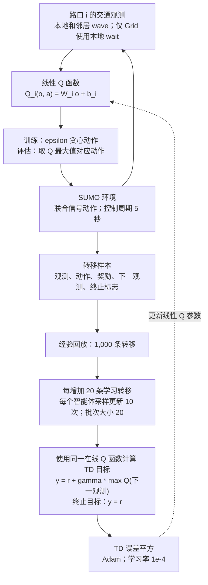
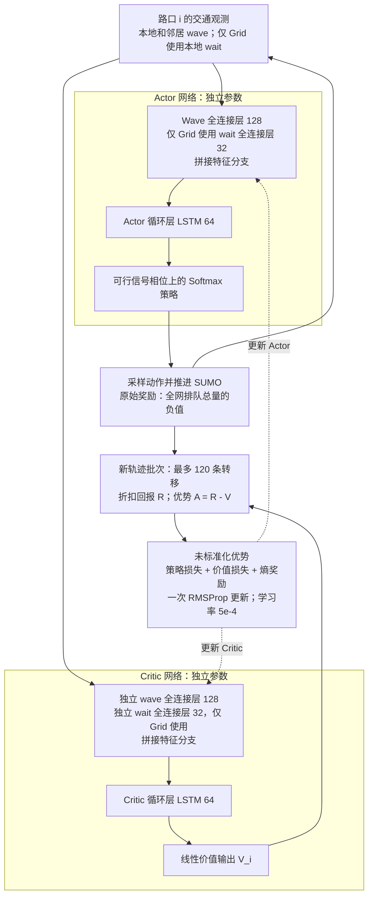
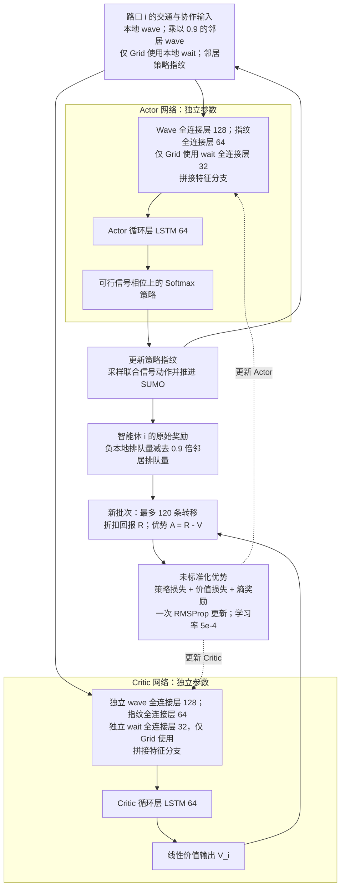
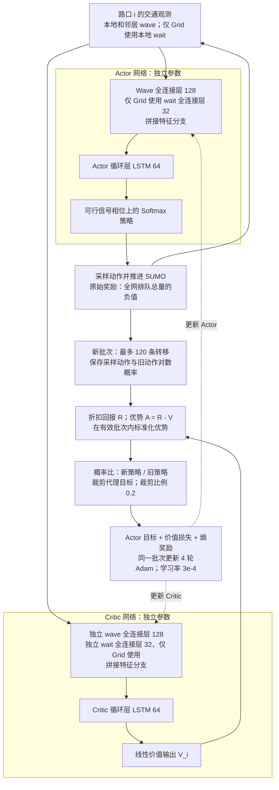

# WCE 共演化为何更有利于 PPO？本地实验诊断报告

日期：2026-10-06  
范围：Protocol v7，训练种子 101，Grid 与 Monaco，40 个选定的最终控制器，9,200 次评估。  
状态：本地诊断报告；不替代正式 Phase F 发布审计。

## 1. 直接回答

**当前结果支持“PPO 与这套 WCE 训练配置的适配性最好”，不支持“WCE 只对 PPO 有用”或“其他算法的结果纯属随机”。** PPO 的在线 WCE 在两套路网的全部 12 个 test 场景中，均取得五种续训方法中的最低平均排队；进一步比较全部 20 个 controller × method 组合，它也在这 24 个 test 场景中全部第一。但在 seen 场景，PPO 的 online WCE 只分别赢得 Grid 6/11、Monaco 5/11；因此“任何场景都最好”仍然不成立。

其他算法呈现不同的稳定倾向：IA2C 更适合较宽的域随机化或原有课程；MA2C 更常受益于随机单组课程，且 Monaco 的峰值外推暴露了 WCE 的弱点；IQLL 的 fixed WCE 可以改善 Grid 的部分场景，但 online WCE 往往不如固定课程。PPO 的优势最可能来自**更新稳定性、优势标准化、同批数据复用与课程覆盖之间的配合**。日志还直接显示，Grid IA2C 的对手发生了明显的需求集中，而 IQLL 续训时探索率已经很低。

## 2. 数据来源、口径与局限

访问了用户指定的 `http://127.0.0.1:8878/`，去除了链接末尾的中文逗号。浏览器实际显示的标题仍是“Preliminary Grid-only results”，覆盖 4,600 条 rollout；当前工作区的站点注册表、release metadata、两套路网 CSV 则已包含 Grid 与 Monaco 各 4,600 条。页面标题与工作区版本存在不一致。本报告以工作区 CSV 为主要统计来源：Grid 首个场景 IA2C baseline 的均值 60.2818，与浏览器显示的 60.28 对账；Monaco 是从本地数据补充分析，不能声称已在当时的浏览器画面验证。

重新计算并核对了两套 `metrics_summary.csv` 与 9,200 条 `rollout_metrics.csv` 的分组均值；检查同一 network/scenario/rollout index 的 20 个组合共享 demand hash、arrival seed、SUMO seed。通过各 evaluation `suite.json` 的精确 checkpoint 路径读取训练 manifest，40 个被评估模型均为 complete、累计 2,320,000 学习步。未按目录时间或“最新实验”猜测模型。

主指标是**受控进口车道去重后的全网排队总量的时间均值**：

\[
Q(t)=\sum_{l\in L_{\mathrm{controlled}}}q_l(t),\qquad
J_Q=\frac{1}{3600}\sum_{t=1}^{3600}Q(t).
\]

单位 vehicles，越低越好，不能称为“每个路口平均排队”。每场景十次评估；seen 11 个场景，test 12 个场景，各 split 内对场景等权平均。Worst 是该 split 的最大场景均值，worst-3 是三个最大场景均值的平均，二者不同于单次 rollout 的 peak queue。

**共同限制：**

- 只有一个训练种子 101。十次评估不能替代十个独立训练模型。
- 下文 bootstrap CI 只反映冻结 checkpoint 和固定场景套件下的评估波动，不反映训练种子不确定性，不作算法总体显著性结论。
- 精确 manifest 显示，**Grid IA2C、MA2C、PPO baseline** 使用 Python 3.10.12 / TensorFlow 2.15.1；Grid IQLL baseline、Monaco 全部 baseline 与所选其他续训方法使用 Python 3.6.13 / TensorFlow 1.12.0。因此不是所有 baseline 都有运行环境差异，但这三个比较确有混杂因素。不能据此比较严格公平的训练速度。
- 当前 `agents/controller.py`、`agents/wce.py`、`agents/policies.py`、`experiments/runner.py`、`envs/experiment_env.py` 与选定 Grid PPO online manifest 的源哈希相符；`experiments/core.py` 不相符。核心奖励解释结合当前代码、工作手册和实际 reward 日志，不把当前整个仓库冒充历史源码的完全一致快照。
- 未重新运行训练或 SUMO，也未重新执行正式 release validator。结果完整性检查不等同于正式发布认证。

## 3. 主要量化结果

以下表格均为原始未平滑数据。

### Test：12 场景平均 queue

| 路网 | 控制器 | 基线 | 随机分组 | 域随机化 | 固定 WCE | 在线 WCE |
| --- | --- | ---: | ---: | ---: | ---: | ---: |
| Grid | IA2C | 80.15 | 79.58 | **75.95** | 81.75 | 90.94 |
| Grid | MA2C | 69.51 | **67.07** | 67.76 | 69.67 | 69.58 |
| Grid | IQLL | 117.48 | 106.25 | 112.13 | **106.10** | 148.72 |
| Grid | PPO | 62.98 | 50.91 | 26.23 | 32.22 | **23.46** |
| Monaco | IA2C | 103.30 | 166.83 | **96.82** | 115.83 | 107.59 |
| Monaco | MA2C | 21.93 | **20.75** | 24.23 | 31.69 | 29.90 |
| Monaco | IQLL | 285.80 | **184.49** | 266.27 | 277.60 | 275.88 |
| Monaco | PPO | 117.34 | 178.35 | 19.83 | 28.29 | **13.18** |

### Seen：11 场景平均 queue

| 路网 | 控制器 | 基线 | 随机分组 | 域随机化 | 固定 WCE | 在线 WCE |
| --- | --- | ---: | ---: | ---: | ---: | ---: |
| Grid | IA2C | 100.09 | **89.17** | 107.49 | 115.22 | 117.12 |
| Grid | MA2C | 92.35 | **90.24** | 100.66 | 103.65 | 103.74 |
| Grid | IQLL | 242.75 | **164.92** | 190.13 | 174.14 | 244.21 |
| Grid | PPO | 92.81 | 60.89 | 44.52 | 58.33 | **41.86** |
| Monaco | IA2C | **52.74** | 69.95 | 57.02 | 62.02 | 56.16 |
| Monaco | MA2C | **22.14** | 22.28 | 23.91 | 28.74 | 24.86 |
| Monaco | IQLL | 155.07 | **94.89** | 128.35 | 143.21 | 133.86 |
| Monaco | PPO | 52.67 | 68.95 | 24.61 | 31.68 | **20.72** |

### Test 场景胜出次数

| 路网 | 控制器 | 基线 | 随机分组 | 域随机化 | 固定 WCE | 在线 WCE |
| --- | --- | ---: | ---: | ---: | ---: | ---: |
| Grid | IA2C | 2 | 2 | 8 | 0 | 0 |
| Grid | MA2C | 0 | 4 | 8 | 0 | 0 |
| Grid | IQLL | 3 | 2 | 0 | 7 | 0 |
| Grid | PPO | 0 | 0 | 0 | 0 | 12 |
| Monaco | IA2C | 4 | 0 | 7 | 1 | 0 |
| Monaco | MA2C | 0 | 7 | 3 | 0 | 2 |
| Monaco | IQLL | 0 | 12 | 0 | 0 | 0 |
| Monaco | PPO | 0 | 0 | 0 | 0 | 12 |

### Test 尾部风险

每格为最差场景 / 最差三场景均值，单位为车辆数，越低越好。

| 路网 | 控制器 | 基线 | 随机分组 | 域随机化 | 固定 WCE | 在线 WCE |
| --- | --- | ---: | ---: | ---: | ---: | ---: |
| Grid | IA2C | 134.49 / 114.80 | 122.54 / 111.20 | 119.57 / 106.08 | 128.33 / 119.22 | 151.01 / 133.83 |
| Grid | MA2C | 102.64 / 92.64 | 100.99 / 88.00 | 101.64 / 91.80 | 104.62 / 96.52 | 104.88 / 97.21 |
| Grid | IQLL | 471.41 / 252.45 | 234.35 / 173.85 | 446.85 / 254.36 | 289.13 / 252.58 | 420.17 / 251.94 |
| Grid | PPO | 138.29 / 97.11 | 84.54 / 66.85 | 36.26 / 34.32 | 55.47 / 44.45 | 32.99 / 29.65 |
| Monaco | IA2C | 205.10 / 178.98 | 252.73 / 242.03 | 209.67 / 181.44 | 222.84 / 205.08 | 213.41 / 187.87 |
| Monaco | MA2C | 55.59 / 36.11 | 46.30 / 32.54 | 85.31 / 46.70 | 122.51 / 67.77 | 110.16 / 65.43 |
| Monaco | IQLL | 341.16 / 339.67 | 242.89 / 236.74 | 323.10 / 319.33 | 323.16 / 321.04 | 318.05 / 314.83 |
| Monaco | PPO | 214.78 / 190.40 | 261.13 / 250.21 | 63.13 / 46.59 | 127.44 / 83.32 | 45.25 / 28.56 |

### Test 配对差值

定义为 online − comparator，负值表示在线 WCE 更好；单位为车辆数。先在同一 rollout index 上对十二场景等权平均，再对十个配对差值做 10,000 次百分位 bootstrap。种子由稳定 SHA-256 标签确定。CI 为条件 95% 区间，没有做训练种子推断或多重检验。

| 路网 | 控制器 | 相对基线：差值 [95% CI] | 相对域随机化 | 相对固定 WCE |
| --- | --- | ---: | ---: | ---: |
| Grid | IA2C | +10.78 [+9.32, +12.32] | +14.99 [+13.11, +16.80] | +9.19 [+7.56, +10.87] |
| Grid | MA2C | +0.07 [-0.48, +0.71] | +1.82 [+1.45, +2.18] | -0.09 [-0.38, +0.24] |
| Grid | IQLL | +31.24 [+26.04, +36.16] | +36.59 [+32.01, +41.03] | +42.62 [+34.37, +50.20] |
| Grid | PPO | -39.53 [-42.29, -37.20] | -2.77 [-2.94, -2.58] | -8.76 [-9.17, -8.43] |
| Monaco | IA2C | +4.29 [+0.41, +8.77] | +10.78 [+6.60, +15.82] | -8.24 [-15.06, -1.15] |
| Monaco | MA2C | +7.98 [+5.57, +10.39] | +5.67 [+2.25, +8.84] | -1.79 [-4.80, +1.64] |
| Monaco | IQLL | -9.92 [-12.60, -7.18] | +9.61 [+7.48, +11.84] | -1.73 [-4.50, +1.05] |
| Monaco | PPO | -104.16 [-110.07, -98.61] | -6.65 [-9.57, -4.19] | -15.11 [-18.07, -12.18] |

### 3.1 可以归纳的规律

**PPO：收益最稳定，但域随机化已经解释了相当一部分改善。** Grid test 平均排队 baseline 62.98 → domain randomization 26.23 → online WCE 23.46；Monaco 117.34 → 19.83 → 13.18。相对 baseline，online 的下降分别为 62.76% 和 88.77%；但相对同 runtime 的 domain randomization，额外下降为 10.57% 和 33.53%。因此大幅改善不能全部归因于“自适应最坏需求搜索”，宽覆盖的混合课程本身很重要。Online 对 DR 的额外收益在本条件评估中也较稳定，CI 见上表。

**IA2C：在线对抗整体更难适配。** Grid online 在 23 个 seen+test 场景中只在 2 个优于 baseline，且从未拿到五方法第一；test DR 赢 8/12。Monaco online test 平均也比 baseline 差 4.16%，DR 赢 7/12。Monaco online 比 fixed 或 random group 好，说明“在线更新对手有时能改善某个对照”与“在线方案整体最佳”是两回事。

**MA2C：总体均值相近时，场景族比曲线直觉更有信息。** Grid test online 与 baseline 的差值仅 +0.067 vehicles，CI 跨零；与 fixed 的差值也跨零。它在 peak/redistribution 族有改善，却在 mixture/temporal 族退化。Monaco 更明显：peak 1.50 的 queue 为 random 46.30、baseline 55.59、DR 85.31、online 110.16、fixed 122.51。Online 在三个 mixture 场景平均可做到 14.12，但在三个 peak 场景平均为 62.57。这是“训练混合分布适配与强度外推之间的冲突”，不是所有场景都无规律。

**IQLL：fixed 与 online 必须分开看，且最差场景改善不等于整体改善。** Grid fixed 在 test 赢 7/12，尤其 peak 与 redistribution；peak 1.50 的 fixed queue 52.10，online 175.47，baseline 93.58。但是 fixed 的 mixture 族平均 152.87，明显差于 baseline 83.15。Online 在 Grid 最差场景均值由 baseline 471.41 降至 420.17，却使 test 总平均由 117.48 升至 148.72。Monaco 的 random group 在全部 12 个 test 场景都胜出；online 比 baseline 平均降低 3.47%，却比 random group 高出 91.39 vehicles。

## 4. 当前训练究竟有什么不同？

### 4.1 预算与课程

| 项目 | 核实设置 |
| --- | --- |
| 初始控制器 | 1,000,000 控制器学习步 |
| 离线 WCE | 500 个回合，控制器冻结 |
| 续训 | 1,000 个回合 × 1,320 步 = 1,320,000 学习步 |
| 最终控制器 | 全部五种方法均为 2,320,000 学习步 |
| 训练回合 | 6,600 秒；控制周期 5 秒；11 个需求窗口 × 600 秒 |
| 基线 | 每窗口依固定顺序激活一个 profile |
| 随机分组（random_group） | 每窗口独立随机抽取一个 profile，可重复、可遗漏 |
| 域随机化（domain_randomization） | 每窗口 Dirichlet(1,…,1) 混合 |
| 固定 WCE（fixed_wce） | 冻结对手参数，仍按状态与 Gaussian 随机性产生权重 |
| 在线 WCE（online_wce） | 同一 offline WCE 起点，继续更新对手与 controller |

“固定 WCE”不等于“固定需求权重”。模型被冻结，输入状态和采样仍会变化。WCE 的 `act()` 先采样 11 维 Gaussian logits，再 softmax 成混合权重。不同控制器各有针对自己 parent 训练的 WCE，因此 online 之间同时改变了控制器与对手；并非四个算法接受完全相同的对抗课程。

### 4.2 优化与函数表示

| 设置 | PPO | IA2C | MA2C | IQLL |
| --- | --- | --- | --- | --- |
| 控制器 | 独立 Actor/Critic：LSTM 64、wave 全连接层 128；仅 Grid 使用 wait 全连接层 32 | 同左 | 独立 Actor/Critic + 邻居指纹全连接层 64 | 线性 Q；无循环状态 |
| 优化器 | Adam | RMSProp | RMSProp | Adam |
| 学习率 | 3e-4，固定 | 5e-4，固定 | 5e-4，固定 | 1e-4，固定 |
| 优势标准化 | 开启 | 关闭 | 关闭 | 不适用 |
| 批次 | 120 条转移 | 120 | 120 | 20 条回放采样转移 |
| 更新方式 | 每个新批次更新 4 轮 | 每个新批次更新 1 次 | 每个新批次更新 1 次 | 每新增 20 条转移，每个智能体更新 10 次 |
| PPO 裁剪比例 | 0.2 | 不适用 | 不适用 | 不适用 |
| 探索设置 | 熵系数 0.01 | 0.01 | 0.01 | epsilon 在 500,000 学习步内由 1.0 降到 0.01 |
| 奖励归一化除数：Grid / Monaco | 3000 / 1000 | 3000 / 1000 | 2000 / 200 | 3000 / 1000 |

所有 controller 的 gamma 为 0.99，reward clip 为 ±2，max gradient norm 为 40。PPO、IA2C 与 MA2C 的 120 步批次刚好对应 600 秒需求窗口；每个窗口 PPO 每个 agent 做四次优化，而 A2C 做一次。IQLL 的 1,000-transition replay 覆盖约 5,000 秒、即 8.33 个需求窗口；新旧需求与其他智能体行为混在一起。Q target 使用同一在线 Q 函数的 next-state max，没有独立 target network 或 Double-Q 分支。以上描述来自实际使用的 `Controller` 路径，而不是旧 `train_coevolution*.py` 的行为推断。

### 4.3 对手并不是纯粹的单窗口 bandit

WCE gamma=1.0，每 11 个窗口完成一次更新，使用 episode 内向后累计回报和 value baseline；offline 500 次更新，online 再做 1,000 次，最终计数 1,500。需求每 600 秒选择一次，**对手参数每 6,600 秒更新一次**。因此 window 早期的 logits 会被后续窗口排队共同影响，包含拥堵积累和车辆残留的跨窗口信用分配。这不一定错误，但与“只最大化当前窗口成本的 contextual bandit”有区别。其 entropy 项约束的是 Gaussian logits 的熵，不等于报告中 softmax 混合权重的熵，不能保证 profile 覆盖。

### 4.4 算法结构与训练流程图

以下为根据本项目实际代码整理的原创结构示意图，并非论文原图。每个路口有独立控制器。实线表示推理或经验流，虚线表示训练更新；层大小来自修订版配置。

**输入差异：**Grid 使用 wave 和本地 wait 特征；Monaco 仅使用 wave，因此下图的 wait 分支仅存在于 Grid。Wave 输入包括本地与直接邻居的测量值。MA2C 额外使用邻居策略指纹，并将邻居 wave 输入乘以 0.9。Actor 与 Critic 的 FC/LSTM 参数和循环状态均独立。

#### IQLL：基于线性回归的独立 Q 学习



**关键区别：**该 IQLL 实现没有 LSTM、独立 Actor、独立 Critic 或目标网络。探索率 epsilon 在 500,000 学习步内由 1.0 降到 0.01，续训开始时已经处于下限。

#### IA2C：独立优势 Actor–Critic



**关键区别：**IA2C 使用独立的循环 Actor 和 Critic 网络，不使用邻居策略指纹。学习前进行奖励归一化与裁剪。完整的 120 条转移对应一个 600 秒需求窗口；终止时不足批次长度的样本使用掩码。

#### MA2C：多智能体优势 Actor–Critic



**关键区别：**MA2C 增加邻居策略信息，并使用本地与邻居共同构成的奖励。它仍是分散式控制，不代表集中式 Critic、不同智能体共享参数或单一全局 Actor。

#### PPO：使用本地 LSTM 控制器的近端策略优化



**关键区别：**本地 PPO 与 IA2C 的网络结构和观测类型相同，主要差别是学习目标、优势标准化、优化器、学习率和更新轮数。当前实现计算折扣回报，并未使用 GAE；四轮更新期间旧动作对数概率保持固定，每一轮都使用同一批次起始循环状态。

**来源对应：**本地[控制器构建与更新](../../agents/controller.py)、[FC/LSTM 特征分支](../../agents/recurrent.py)、[独立 Actor/Critic 与线性 Q](../../agents/policies.py)、[状态拼接](../../envs/env.py)、[Grid 特征选择](../../envs/large_grid_env.py)和[Monaco 特征选择](../../envs/real_net_env.py)。原始参考图见 [Chu 等，Fig. 1，第 6 页](https://arxiv.org/pdf/1903.04527#page=6)及[Algorithm 1，第 5 页](https://arxiv.org/pdf/1903.04527#page=5)；PPO 训练流程见 [Schulman 等，Algorithm 1，第 5 页](https://arxiv.org/pdf/1707.06347#page=5)。存在差异时，以本地实现为准。

## 5. 实际日志中的机制证据

下面统计 first/last 100 个续训 episode，每段 1,100 个窗口；熵用自然对数，最大值 log(11)=2.398。H 为逐窗口混合权重熵的平均；最大权重为逐窗口 max 的平均；并非 Gaussian entropy loss。训练 Q 在变化的需求课程上测得，不是固定测试集学习曲线。

| 路网 | 控制器 | 在线 WCE 熵 H：前期 → 后期 | 在线 WCE 最大权重均值：前期 → 后期 | 在线 WCE 训练排队：前期 → 后期 | 固定 WCE 训练排队：前期 → 后期 |
| --- | --- | ---: | ---: | ---: | ---: |
| Grid | IA2C | 2.232 → 0.939 | 0.212 → 0.734 | 87.23 → 134.38 | 87.98 → 87.30 |
| Grid | MA2C | 2.233 → 2.178 | 0.212 → 0.235 | 71.88 → 72.99 | 72.46 → 69.83 |
| Grid | IQLL | 2.223 → 1.994 | 0.216 → 0.304 | 145.67 → 169.00 | 142.41 → 180.00 |
| Grid | PPO | 2.234 → 2.163 | 0.211 → 0.243 | 50.10 → 25.22 | 51.67 → 32.25 |
| Monaco | IA2C | 2.234 → 2.217 | 0.211 → 0.220 | 60.99 → 30.71 | 57.23 → 28.85 |
| Monaco | MA2C | 2.234 → 2.178 | 0.211 → 0.237 | 18.83 → 16.02 | 19.03 → 16.99 |
| Monaco | IQLL | 2.169 → 2.097 | 0.242 → 0.266 | 321.49 → 324.46 | 313.60 → 314.20 |
| Monaco | PPO | 2.235 → 2.221 | 0.211 → 0.217 | 48.99 → 7.91 | 47.86 → 10.00 |

**日志解读：**

1. **最强的课程集中证据出现在 Grid IA2C。** 后期 `SW_to_NE` 的平均权重为 0.727，逐窗口最大权重平均 0.734，H=0.939；前期 H=2.232。同时课程内平均 queue 从 87.23 升到 134.38，固定测试表现也普遍退化。这与“对手越来越偏、控制器未跟上或遗忘其他场景”一致。不能仅凭训练 queue 上升认定 controller 学坏，因为需求本身在变；固定评估的退化提供了额外证据。
2. **PPO 的 online 权重保持宽覆盖。** Grid H 从 2.234 到 2.163，Monaco 从 2.235 到 2.221；训练 queue 分别从 50.10 到 25.22、48.99 到 7.91。没有看到与 IA2C 类似的严重单方向集中，且固定 test 的优势一致。这更像“可学习的宽覆盖适应课程”，而不是越强越偏的攻击。
3. **Fixed WCE 普遍接近宽混合课程。** Grid 的四个 fixed WCE 后期 H 约 2.225–2.235，逐窗口最大权重约 0.211–0.215。这不能证明对手没学到任何东西，但意味着不能把它描述为已找到一个明确、尖锐的最坏单组分布。
4. **IQLL 存在函数容量和探索瓶颈的迹象。** 实际 learner 日志首条续训记录已是 epsilon=0.01、replay occupancy=1000。Monaco online 的训练 queue 后期约 324.46，仍很高；其评估也有严重未插入、残留和 teleport。仅改变采样分布可能无法解决线性表示与多智能体 TD 学习的问题。
5. **Reward clipping 暂不是选定 WCE 续训的主解释。** 16 个 fixed/online selected run 的 1,000 条 episode 指标均报告 controller reward clip fraction=0。这个结论覆盖这些日志，不扩展到 parent、其他方法或未审计的历史运行。优势尺度、critic 误差和 observation clipping 仍可能重要。

## 6. 可能原因及证据强弱

### A. PPO 能更稳定地吸收变化的课程

**已核实差异：**PPO 有 ratio clipping、advantage normalization、较小学习率和四次 batch reuse；A2C 无 advantage normalization，仅一次更新。**推断：**需求切换改变 reward/return 的尺度与方差，PPO 的 actor 更少受未经标准化优势的幅度波动影响，能反复利用当前窗口的新数据。与[原始 PPO 论文](https://arxiv.org/abs/1707.06347)的裁剪代理目标与多轮样本复用设计一致。但 PPO clipping 不保证实际策略永远处于严格 trust region；优势标准化也不标准化 critic target。

### B. A2C 的奖励尺度、熵与 critic 更新配合不同

**已核实：**IA2C/MA2C 使用未标准化优势；各 family 的 reward norm 不同，MA2C 又使用局部+邻居奖励。**推断：**当局部 scaled return 较小，固定 entropy coefficient 相对 actor 信号可能偏大；当 return 变化大，critic 梯度可能影响 actor/critic 合并计算的全局梯度裁剪系数。当前 actor 与 critic 各有独立 FC/LSTM 网络，不共享表示。不能仅凭 INI 中 entropy=0.01 就认为各算法探索强度等价，也不能未统计梯度就宣布出现“梯度爆炸”。

### C. MA2C 的局部目标与 WCE 全局目标没有严格逐智能体对齐

MA2C 每个 agent 的 raw reward 是本地 queue 加 0.9 倍邻居 queue 的负值；WCE 最大化全网 600 秒平均 queue。全体 MA2C rewards 求和后，不同节点因邻接度获得不同系数，尤其不规则 Monaco 并不等价于同一个全局 queue 乘常数。Fingerprints 能帮助理解邻居动作，却不能自动修正全局瓶颈的信用分配。**推断：**对手找到了全网弱点，但局部 controller 未获得恰当的改进信号；peak 外推下局部协调优势也可能被堵塞放大。已有数据不足以将失败归因于“fingerprint 冗余”。

### D. IQLL 的低探索、线性表示与 replay 非平稳性

epsilon 在 parent 的 500,000 步后已经到下限，续训不重启探索；linear Q 不能像 LSTM 一样利用交通残留历史。Replay 约横跨八个窗口，需求、其他 agents 的策略与自身 Q target 都在变。在线对手额外引入分布变化，fixed 则至少少一个变化来源。多智能体 replay 的非平稳性是已有研究指出的问题，参见[Foerster 等人的原始论文](https://proceedings.mlr.press/v70/foerster17b.html)。这里 replay 小、会持续刷新，因此不能把全部问题简单归为“非常老的缓存”；也不能把线性 IQLL 当成使用 target network 的现代 DQN 来解释。

### E. WCE 课程覆盖、时间尺度与训练分布支持

归一化训练 profile 的总需求率相同；WCE 只改变 OD 混合，没有显式峰值乘数。Peak 1.10/1.25/1.50 是强度外推，无法期待混合课程自动覆盖。训练中每 600 秒切换，seen 和 mixture 评估却将 profile 保持 3,600 秒；也改变了持续负荷和堵塞累积的条件。训练更强的对手不必然得到更通用的策略。如果没有覆盖下界、保留 nominal 数据或 adversarial strength 调节，可能在困难局部获得收益、在其他场景遗忘。Grid IA2C 集中日志是这类问题的直接线索；Monaco MA2C 的 peak 退化是外推不足的线索。

## 7. 论文与当前实验不能混用

核查对象是本地 PDF《A Distributionally Robust Multiagent Reinforcement Learning Framework for Intelligent Intersection Control》，重点为第 5–8 页的 Algorithm 1、WCE 定义和实验协议，以及结果讨论。

| 项目 | 本地论文 | 当前实现和数据 |
| --- | --- | --- |
| WCE 观测 | 每路口前一窗口的平均速度与密度 | Grid：补齐维度的 wave + wait；Monaco：补齐维度的 wave |
| WCE 奖励 | 式 (8)：车辆等待贡献的累计值 | 受控进口车道全网排队总量的 600 秒均值，在学习器边界缩放 |
| WCE 更新 | 式 (9)：上下文 bandit 奖励 × 对数概率，回放小批次 | gamma=1 的回合回报与价值基线，每 11 个窗口更新一次 |
| 评估场景 | 11 个已见场景 + 一个 Group 12 | 11 个已见场景 + 12 个冻结测试场景 |
| 比较方式 | 基线与分布鲁棒续训比较 | 五种控制器学习步数相同的续训方法 |
| 整体结论 | 讨论四种架构的收益 | 在线方案的稳定优势主要出现在 PPO；其他算法效果混合 |

论文的三阶段预算基本对应本地训练，但 observation、reward、更新目标与评估套件存在实质差异。旧论文的“跨架构一致改善”和旧百分比不能当成本次结果。框架可以接入多种控制器，不等于它在每种优化器、每种 reward scale、每个 seed 下都保证改善。本次更合适的论点是“收益依赖 controller 的优化和表示能力，并与课程覆盖共同作用”。

## 8. 指标交叉核对

PPO 的提升不只体现在排队。Test 中 Grid online 相对 DR 的 speed 为 7.78 vs 7.52 m/s、completed 为 2939.05 vs 2936.61、remaining 为 119.63 vs 127.96；但 pending 为 9.68 vs 3.79，说明它并非所有指标都更优。Monaco online 相对 DR 的 speed 为 7.01 vs 6.38、completed 为 2308.60 vs 2268.53、pending 为 63.94 vs 91.80、remaining 为 64.95 vs 76.98、teleports 为 4.87 vs 9.78。主趋势有通行结果支持，但不能写成“无碰撞/全部可靠性指标最好”。

IQLL 特别需要谨慎：Grid fixed 相对 baseline 虽然平均 queue 降低，但 completed 为 2610.07 vs 2626.23、pending 为 121.86 vs 100.10，不支持所有通行结果同时改善。Monaco online IQLL test 平均 pending 1345.31、remaining 559.73、teleports 471.26。严重拥堵会阻止车辆进入受控网络，且 SUMO teleport 会改变队列轨迹；这使小 queue 差值不能独立解释为整体出行改善。Completed-trip travel/waiting 均值还存在只统计已完成车辆的选择偏差。

## 9. 建议验证顺序

这些是后续实验建议，本次没有改配置或启动训练。

| 优先级 | 实验 | 要区分的原因 |
| --- | --- | --- |
| 1 | IA2C/MA2C 开启优势标准化，其他设置和预算保持一致 | 奖励与优势尺度，还是控制器类型 |
| 1 | PPO 分别消融优势标准化，以及将更新轮数从 4 改为 1 | 标准化与数据复用，不能仅归功于裁剪 |
| 1 | IA2C 在线方案保留名义混合数据或加入单纯形覆盖下界，并记录实际权重熵 | 课程集中与遗忘，还是学习不足 |
| 1 | IQLL 续训时重启探索；单独比较清空与保留经验回放 | 低探索，还是继承回放的影响 |
| 2 | IQLL 从线性改为非线性或循环表示；将目标网络作为独立变体测试 | 表示能力，还是不断变化的自举目标 |
| 2 | MA2C 在相同课程下比较现有局部奖励与全局奖励 | 局部与全局信用分配不匹配 |
| 2 | 在新训练协议中加入峰值缩放，仅使用验证集调参 | 插值覆盖，还是需求强度外推 |
| 2 | 冻结共享的 WCE 课程记录，在不同控制器上重放，与各自对手训练比较 | 学习器适配性，还是对手差异 |
| 3 | 至少使用三个独立训练种子，在一致环境下重复续训，并配对评估种子 | 可重复训练效果，还是种子 101 的特定结果 |

优先用最少改动验证已有线索；一次只改变一个因素。新增调参使用 validation，当前 test 套件只用于报告，不能反复挑选超参数后继续称为“冻结的零样本测试”。诊断图应同步记录 actual mixture entropy、profile coverage、actor/critic gradient norms、policy entropy、PPO clipping fraction、TD error 与固定 monitor 场景 performance。Gaussian entropy 单独不足以说明需求覆盖。

## 10. 可用于论文的结论

“在 Protocol v7、训练种子 101 的冻结评估中，在线 WCE 与 PPO 的结合在 Grid 和 Monaco 的全部十二个测试场景中取得了最低平均排队，并同时改善测试套件的平均和最差场景表现。IA2C、MA2C 与 IQLL 的收益依赖路网、场景族和课程形式，随机分组、域随机化或固定 WCE 在部分条件下更有利。训练日志显示，不同控制器伴随不同的需求权重集中程度；结合探索率、函数表示及优化配置，这些结果提示在线对抗训练的收益依赖控制器适应能力与课程覆盖。当前单训练种子设计尚不足以建立跨架构普遍改善或确定因果机制。”

## 11. 可复核文件

在仓库根目录执行：

```bash
python3 reports/wce_analysis_20261006/analyze.py
```

该脚本仅读取结果与精确选定的训练记录，生成统计文件；不执行训练或评估。

- [分组指标](aggregate_metrics.csv)
- [配对效应与条件 bootstrap CI](paired_effects.csv)
- [需求权重诊断](wce_weight_diagnostics.csv)
- [逐场景排名](scenario_rankings.csv)
- [所选训练 manifest 摘要](selected_training_evidence.json)
- [本次数据对账结果](validation.json)

主要本地来源：

- [协议 v7](../../config/revised/protocol.json)
- [Grid 汇总](../../docs/evaluation_workbook/grid_results_site/dist/data/metrics_summary.csv) / [Monaco 汇总](../../docs/evaluation_workbook/grid_results_site/dist/data/networks/monaco/metrics_summary.csv)
- [Grid 评估数据](../../docs/evaluation_workbook/grid_results_site/dist/data/rollout_metrics.csv) / [Monaco 评估数据](../../docs/evaluation_workbook/grid_results_site/dist/data/networks/monaco/rollout_metrics.csv)
- [控制器适配器](../../agents/controller.py), [WCE 实现](../../agents/wce.py), [线性 Q 与高斯策略](../../agents/policies.py)
- [运行器与课程](../../experiments/runner.py), [排队指标](../../experiments/core.py), [环境观测与奖励](../../envs/experiment_env.py), [归一化需求分布](../../experiments/demand.py)
- [修订版配置](../../config/revised/README.md): `config_{ppo,ia2c,ma2c,iqll}_{large,real}.ini`, `config_wce_{large,real}.ini`
- [评估工作手册](../../docs/evaluation_workbook/cb_wce_evaluation_workbook.md): 指标定义与审计边界；其中 2026-09-29 的待完成状态文字属于历史记录。
- [便携版本元数据](../../docs/evaluation_workbook/grid_results_site/release.json) / [恢复说明](../../docs/evaluation_workbook/grid_results_site/RESTORE.md): 当前本地快照，不是正式发布认证。
- [本地论文 PDF](<../../paper/A Distributionally Robust Multiagent Reinforcement Learning Framework for Intelligent Intersection Control.pdf>)
- [PPO 原始论文](https://arxiv.org/abs/1707.06347)和[多智能体经验回放原始论文](https://proceedings.mlr.press/v70/foerster17b.html): 仅为理论动机，不是本次运行中因果关系的证据。
