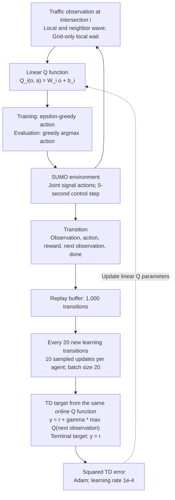
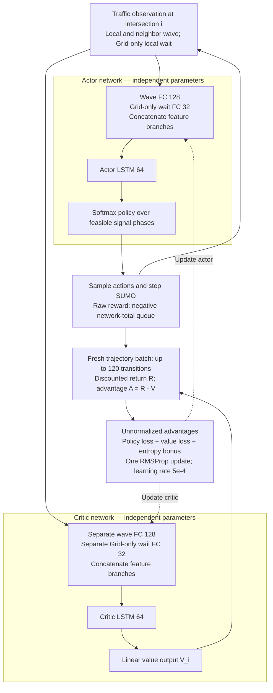
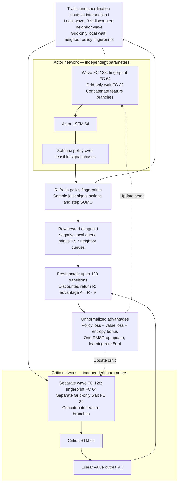
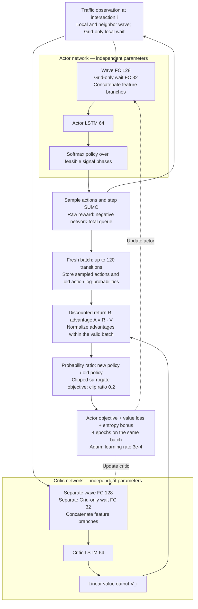

# WCE 共演化为何更有利于 PPO？本地实验诊断报告
# Why Does WCE Co-evolution Benefit PPO More? A Local Experimental Diagnosis

日期 / Date: 2026-10-06  
范围 / Scope: Protocol v7, training seed 101, Grid + Monaco, 40 selected final controllers, 9,200 evaluation rollouts.  
状态 / Status: 本地诊断报告；不替代正式 Phase F 发布审计。Local diagnostic report; not a substitute for the formal Phase F release audit.

## 1. 直接回答 / Direct answer

**中文：当前结果支持“PPO 与这套 WCE 训练配置的适配性最好”，不支持“WCE 只对 PPO 有用”或“其他算法的结果纯属随机”。** PPO 的在线 WCE 在两套路网的全部 12 个 test 场景中，均取得五种续训方法中的最低平均排队；进一步比较全部 20 个 controller × method 组合，它也在这 24 个 test 场景中全部第一。但在 seen 场景，PPO 的 online WCE 只分别赢得 Grid 6/11、Monaco 5/11；因此“任何场景都最好”仍然不成立。

其他算法呈现不同的稳定倾向：IA2C 更适合较宽的域随机化或原有课程；MA2C 更常受益于随机单组课程，且 Monaco 的峰值外推暴露了 WCE 的弱点；IQLL 的 fixed WCE 可以改善 Grid 的部分场景，但 online WCE 往往不如固定课程。PPO 的优势最可能来自**更新稳定性、优势标准化、同批数据复用与课程覆盖之间的配合**。日志还直接显示，Grid IA2C 的对手发生了明显的需求集中，而 IQLL 续训时探索率已经很低。

**English:** The evidence supports a strong match between PPO and this particular WCE configuration, rather than exclusive usefulness of WCE for PPO or purely random outcomes for the other controllers. PPO online WCE has the lowest mean queue in all 12 test scenarios in each network, both within PPO and across all 20 controller–method combinations. On seen scenarios, however, it wins only 6/11 in Grid and 5/11 in Monaco.

The other controllers show structured preferences: IA2C often favors broader domain randomization or the original curriculum; MA2C often favors random single-profile training, with WCE weaknesses appearing under Monaco peak extrapolation; fixed WCE helps IQLL in some Grid scenarios, while online adaptation often hurts. The leading explanation is the interaction between update stability, advantage normalization, repeated use of fresh data, and curriculum coverage. Training logs additionally show pronounced adversarial concentration for Grid IA2C and low exploration during IQLL continuation. These are supported mechanisms to investigate, not established causal explanations.

## 2. 数据来源、口径与局限 / Sources, definitions, and limits

**中文：**访问了用户指定的 `http://127.0.0.1:8878/`，去除了链接末尾的中文逗号。浏览器实际显示的标题仍是“Preliminary Grid-only results”，覆盖 4,600 条 rollout；当前工作区的站点注册表、release metadata、两套路网 CSV 则已包含 Grid 与 Monaco 各 4,600 条。页面标题与工作区版本存在不一致。本报告以工作区 CSV 为主要统计来源：Grid 首个场景 IA2C baseline 的均值 60.2818，与浏览器显示的 60.28 对账；Monaco 是从本地数据补充分析，不能声称已在当时的浏览器画面验证。

重新计算并核对了两套 `metrics_summary.csv` 与 9,200 条 `rollout_metrics.csv` 的分组均值；检查同一 network/scenario/rollout index 的 20 个组合共享 demand hash、arrival seed、SUMO seed。通过各 evaluation `suite.json` 的精确 checkpoint 路径读取训练 manifest，40 个被评估模型均为 complete、累计 2,320,000 学习步。未按目录时间或“最新实验”猜测模型。

主指标是**受控进口车道去重后的全网排队总量的时间均值**：

\[
Q(t)=\sum_{l\in L_{\mathrm{controlled}}}q_l(t),\qquad
J_Q=\frac{1}{3600}\sum_{t=1}^{3600}Q(t).
\]

单位 vehicles，越低越好，不能称为“每个路口平均排队”。每场景十次评估；seen 11 个场景，test 12 个场景，各 split 内对场景等权平均。Worst 是该 split 的最大场景均值，worst-3 是三个最大场景均值的平均，二者不同于单次 rollout 的 peak queue。

**English:** The requested browser page still displayed a 4,600-rollout Grid-only snapshot. The workspace registry, release metadata, and CSVs include both networks, with 4,600 rollouts each. This report uses the workspace CSVs, with a directly checked Grid value matching the browser; Monaco is a local-data extension, not a claim about the browser's displayed snapshot.

Grouped means were reconciled against all 9,200 rollout records, and demand hashes plus arrival/SUMO seeds were checked across the 20 combinations for each paired evaluation index. Training manifests were resolved through the exact evaluation suite checkpoint paths; all 40 selected final controllers are complete at 2,320,000 learning steps. The primary metric is the time-averaged network-total queue over deduplicated controlled approach lanes, not queue per intersection. Scenario means are equally weighted within each split. Worst and worst-3 operate on scenario means, not instantaneous peaks.

**共同限制 / Shared limitations:**

- 只有一个训练种子 101。十次 evaluation 不能替代十个独立训练模型。One training seed; ten evaluation rollouts do not represent ten independent training runs.
- 下文 bootstrap CI 只反映冻结 checkpoint 和固定场景套件下的评估波动，不反映训练种子不确定性，不作算法总体显著性结论。Intervals are conditional on the frozen models and suite, not population-level algorithm significance.
- 精确 manifest 显示，**Grid IA2C、MA2C、PPO baseline** 使用 Python 3.10.12 / TensorFlow 2.15.1；Grid IQLL baseline、Monaco 全部 baseline 与所选其他续训方法使用 Python 3.6.13 / TensorFlow 1.12.0。因此不是所有 baseline 都有 runtime 差异，但这三个比较确有混杂因素。不能据此比较严格公平的训练速度。Runtime differences affect three Grid baselines specifically; they preclude strict training-speed fairness claims.
- 当前 `agents/controller.py`、`agents/wce.py`、`agents/policies.py`、`experiments/runner.py`、`envs/experiment_env.py` 与选定 Grid PPO online manifest 的源哈希相符；`experiments/core.py` 不相符。核心奖励解释结合当前代码、工作手册和实际 reward 日志，不把当前整个仓库冒充历史源码的完全一致快照。The current repository is not an entirely identical historical source snapshot.
- 未重新运行训练或 SUMO，也未重新执行正式 release validator。结果完整性检查不等同于正式发布认证。No retraining, simulation, or formal release certification was performed.

## 3. 主要量化结果 / Main quantitative findings

以下表格均为原始未平滑数据。All tables use unsmoothed measurements.

### Test：12 场景平均 queue / Mean queue across 12 test scenarios

| Network | Controller | baseline | random group | domain randomization | fixed WCE | online WCE |
| --- | --- | ---: | ---: | ---: | ---: | ---: |
| Grid | IA2C | 80.15 | 79.58 | **75.95** | 81.75 | 90.94 |
| Grid | MA2C | 69.51 | **67.07** | 67.76 | 69.67 | 69.58 |
| Grid | IQLL | 117.48 | 106.25 | 112.13 | **106.10** | 148.72 |
| Grid | PPO | 62.98 | 50.91 | 26.23 | 32.22 | **23.46** |
| Monaco | IA2C | 103.30 | 166.83 | **96.82** | 115.83 | 107.59 |
| Monaco | MA2C | 21.93 | **20.75** | 24.23 | 31.69 | 29.90 |
| Monaco | IQLL | 285.80 | **184.49** | 266.27 | 277.60 | 275.88 |
| Monaco | PPO | 117.34 | 178.35 | 19.83 | 28.29 | **13.18** |

### Seen：11 场景平均 queue / Mean queue across 11 seen scenarios

| Network | Controller | baseline | random group | domain randomization | fixed WCE | online WCE |
| --- | --- | ---: | ---: | ---: | ---: | ---: |
| Grid | IA2C | 100.09 | **89.17** | 107.49 | 115.22 | 117.12 |
| Grid | MA2C | 92.35 | **90.24** | 100.66 | 103.65 | 103.74 |
| Grid | IQLL | 242.75 | **164.92** | 190.13 | 174.14 | 244.21 |
| Grid | PPO | 92.81 | 60.89 | 44.52 | 58.33 | **41.86** |
| Monaco | IA2C | **52.74** | 69.95 | 57.02 | 62.02 | 56.16 |
| Monaco | MA2C | **22.14** | 22.28 | 23.91 | 28.74 | 24.86 |
| Monaco | IQLL | 155.07 | **94.89** | 128.35 | 143.21 | 133.86 |
| Monaco | PPO | 52.67 | 68.95 | 24.61 | 31.68 | **20.72** |

### Test 场景胜出次数 / Number of test-scenario wins within each controller

| Network | Controller | baseline | random group | domain randomization | fixed WCE | online WCE |
| --- | --- | ---: | ---: | ---: | ---: | ---: |
| Grid | IA2C | 2 | 2 | 8 | 0 | 0 |
| Grid | MA2C | 0 | 4 | 8 | 0 | 0 |
| Grid | IQLL | 3 | 2 | 0 | 7 | 0 |
| Grid | PPO | 0 | 0 | 0 | 0 | 12 |
| Monaco | IA2C | 4 | 0 | 7 | 1 | 0 |
| Monaco | MA2C | 0 | 7 | 3 | 0 | 2 |
| Monaco | IQLL | 0 | 12 | 0 | 0 | 0 |
| Monaco | PPO | 0 | 0 | 0 | 0 | 12 |

### Test 尾部风险 / Test tail performance

每格为 worst / worst-3，单位 vehicles；越低越好。Each cell is worst / worst-3 in vehicles; lower is better.

| Network | Controller | baseline | random group | domain randomization | fixed WCE | online WCE |
| --- | --- | ---: | ---: | ---: | ---: | ---: |
| Grid | IA2C | 134.49 / 114.80 | 122.54 / 111.20 | 119.57 / 106.08 | 128.33 / 119.22 | 151.01 / 133.83 |
| Grid | MA2C | 102.64 / 92.64 | 100.99 / 88.00 | 101.64 / 91.80 | 104.62 / 96.52 | 104.88 / 97.21 |
| Grid | IQLL | 471.41 / 252.45 | 234.35 / 173.85 | 446.85 / 254.36 | 289.13 / 252.58 | 420.17 / 251.94 |
| Grid | PPO | 138.29 / 97.11 | 84.54 / 66.85 | 36.26 / 34.32 | 55.47 / 44.45 | 32.99 / 29.65 |
| Monaco | IA2C | 205.10 / 178.98 | 252.73 / 242.03 | 209.67 / 181.44 | 222.84 / 205.08 | 213.41 / 187.87 |
| Monaco | MA2C | 55.59 / 36.11 | 46.30 / 32.54 | 85.31 / 46.70 | 122.51 / 67.77 | 110.16 / 65.43 |
| Monaco | IQLL | 341.16 / 339.67 | 242.89 / 236.74 | 323.10 / 319.33 | 323.16 / 321.04 | 318.05 / 314.83 |
| Monaco | PPO | 214.78 / 190.40 | 261.13 / 250.21 | 63.13 / 46.59 | 127.44 / 83.32 | 45.25 / 28.56 |

### Test 配对差值 / Paired test-suite differences

定义 online − comparator，负值表示 online 更好；单位 vehicles。先在同一 rollout index 上对十二场景等权平均，再对十个配对差值做 10,000 次 percentile bootstrap。种子由稳定 SHA-256 标签确定。CI 为条件 95% 区间，没有做训练种子推断或多重检验。Negative favors online; intervals are conditional evaluation uncertainty, not training-seed uncertainty.

| Network | Controller | vs baseline: delta [95% CI] | vs domain randomization | vs fixed WCE |
| --- | --- | ---: | ---: | ---: |
| Grid | IA2C | +10.78 [+9.32, +12.32] | +14.99 [+13.11, +16.80] | +9.19 [+7.56, +10.87] |
| Grid | MA2C | +0.07 [-0.48, +0.71] | +1.82 [+1.45, +2.18] | -0.09 [-0.38, +0.24] |
| Grid | IQLL | +31.24 [+26.04, +36.16] | +36.59 [+32.01, +41.03] | +42.62 [+34.37, +50.20] |
| Grid | PPO | -39.53 [-42.29, -37.20] | -2.77 [-2.94, -2.58] | -8.76 [-9.17, -8.43] |
| Monaco | IA2C | +4.29 [+0.41, +8.77] | +10.78 [+6.60, +15.82] | -8.24 [-15.06, -1.15] |
| Monaco | MA2C | +7.98 [+5.57, +10.39] | +5.67 [+2.25, +8.84] | -1.79 [-4.80, +1.64] |
| Monaco | IQLL | -9.92 [-12.60, -7.18] | +9.61 [+7.48, +11.84] | -1.73 [-4.50, +1.05] |
| Monaco | PPO | -104.16 [-110.07, -98.61] | -6.65 [-9.57, -4.19] | -15.11 [-18.07, -12.18] |


### 3.1 可以归纳的规律 / Patterns supported by the data

**PPO：收益最稳定，但域随机化已经解释了相当一部分改善。** Grid test 平均排队 baseline 62.98 → domain randomization 26.23 → online WCE 23.46；Monaco 117.34 → 19.83 → 13.18。相对 baseline，online 的下降分别为 62.76% 和 88.77%；但相对同 runtime 的 domain randomization，额外下降为 10.57% 和 33.53%。因此大幅改善不能全部归因于“自适应最坏需求搜索”，宽覆盖的混合课程本身很重要。Online 对 DR 的额外收益在本条件评估中也较稳定，CI 见上表。

**PPO:** Gains are consistent, but broad mixture training explains a substantial fraction. Test mean queue changes from 62.98 to 26.23 to 23.46 in Grid, and 117.34 to 19.83 to 13.18 in Monaco, for baseline, domain randomization, and online WCE. Online improves over baseline by 62.76%/88.77%, but its incremental reduction over domain randomization is 10.57%/33.53%. The total gain should not be attributed entirely to adaptive adversarial search.

**IA2C：在线对抗整体更难适配。** Grid online 在 23 个 seen+test 场景中只在 2 个优于 baseline，且从未拿到五方法第一；test DR 赢 8/12。Monaco online test 平均也比 baseline 差 4.16%，DR 赢 7/12。Monaco online 比 fixed 或 random group 好，说明“在线更新对手有时能改善某个对照”与“在线方案整体最佳”是两回事。

**IA2C:** Online WCE beats baseline in only 2/23 Grid scenarios and never wins among the five methods there; domain randomization wins 8/12 Grid and 7/12 Monaco test scenarios. Monaco online test queue is 4.16% worse than baseline, although it improves over fixed WCE and random grouping. Improving one comparator is different from being the best method overall.

**MA2C：总体均值相近时，场景族比曲线直觉更有信息。** Grid test online 与 baseline 的差值仅 +0.067 vehicles，CI 跨零；与 fixed 的差值也跨零。它在 peak/redistribution 族有改善，却在 mixture/temporal 族退化。Monaco 更明显：peak 1.50 的 queue 为 random 46.30、baseline 55.59、DR 85.31、online 110.16、fixed 122.51。Online 在三个 mixture 场景平均可做到 14.12，但在三个 peak 场景平均为 62.57。这是“训练混合分布适配与强度外推之间的冲突”，不是所有场景都无规律。

**MA2C:** Small overall differences hide scenario-family structure. Grid online differs from baseline by only +0.067 vehicles, with an interval crossing zero; the fixed comparison also crosses zero. Peak and redistribution improve while mixture and temporal performance deteriorate. In Monaco peak 1.50, queues are 46.30 for random grouping, 55.59 baseline, 85.31 DR, 110.16 online, and 122.51 fixed. Online averages 14.12 on mixtures but 62.57 on peaks. This suggests a mixture-training versus intensity-extrapolation tradeoff.

**IQLL：fixed 与 online 必须分开看，且最差场景改善不等于整体改善。** Grid fixed 在 test 赢 7/12，尤其 peak 与 redistribution；peak 1.50 的 fixed queue 52.10，online 175.47，baseline 93.58。但是 fixed 的 mixture 族平均 152.87，明显差于 baseline 83.15。Online 在 Grid 最差场景均值由 baseline 471.41 降至 420.17，却使 test 总平均由 117.48 升至 148.72。Monaco 的 random group 在全部 12 个 test 场景都胜出；online 比 baseline 平均降低 3.47%，却比 random group 高出 91.39 vehicles。

**IQLL:** Fixed and online WCE have different effects. Grid fixed wins 7/12 test scenarios, especially peaks and redistribution: at peak 1.50 it yields 52.10 versus online 175.47 and baseline 93.58. Yet its mixture-family mean is 152.87 versus baseline 83.15. Grid online lowers the worst scenario mean from 471.41 to 420.17 while worsening the test average from 117.48 to 148.72. Monaco random grouping wins all 12 test scenarios; online modestly improves over baseline but remains 91.39 vehicles worse than random grouping.

## 4. 当前训练究竟有什么不同？ / What differs in the implemented training?

### 4.1 预算与课程 / Budget and curriculum

| 项目 / Item | 核实设置 / Verified setting |
| --- | --- |
| Parent | 1,000,000 controller learning steps |
| Offline WCE | 500 episodes, controller frozen |
| Continuation | 1,000 episodes × 1,320 steps = 1,320,000 learning steps |
| Final controller | 2,320,000 learning steps for all five methods |
| Episode | 6,600 s; 5-s control; 11 demand windows × 600 s |
| baseline | 每窗口依固定顺序激活一个 profile / fixed ordered one-profile curriculum |
| random_group | 每窗口独立随机抽取一个 profile，可重复、可遗漏 / random one-hot profile, repetitions and omissions allowed |
| domain_randomization | 每窗口 Dirichlet(1,…,1) 混合 / fresh Dirichlet mixture per window |
| fixed_wce | 冻结对手参数，仍按状态与 Gaussian 随机性产生权重 / frozen parameters, state-dependent stochastic weights |
| online_wce | 同一 offline WCE 起点，继续更新对手与 controller / same pretrained adversary, continuing joint adaptation |

**中文：**“固定 WCE”不等于“固定需求权重”。模型被冻结，输入状态和采样仍会变化。WCE 的 `act()` 先采样 11 维 Gaussian logits，再 softmax 成混合权重。不同控制器各有针对自己 parent 训练的 WCE，因此 online 之间同时改变了控制器与对手；并非四个算法接受完全相同的对抗课程。

**English:** Fixed WCE freezes network parameters, not demand weights. State and Gaussian sampling still vary. WCE samples eleven Gaussian logits and maps them through softmax. Each controller has its own adversary trained against its parent, so cross-controller comparisons also involve different curricula.

### 4.2 优化与函数表示 / Optimization and representation

| 设置 / Setting | PPO | IA2C | MA2C | IQLL |
| --- | --- | --- | --- | --- |
| Controller | Separate actor/critic: LSTM 64, wave FC 128; Grid-only wait FC 32 | 同左 / same | Separate actor/critic + neighbor fingerprints FC 64 | Linear Q; no recurrent state |
| Optimizer | Adam | RMSProp | RMSProp | Adam |
| Learning rate | 3e-4 constant | 5e-4 constant | 5e-4 constant | 1e-4 constant |
| Advantage normalization | true | false | false | N/A |
| Batch | 120 transitions | 120 | 120 | 20 sampled replay transitions |
| Updates | 4 epochs per fresh batch | 1 per fresh batch | 1 per fresh batch | every 20 new transitions, 10 updates per agent |
| PPO clip ratio | 0.2 | N/A | N/A | N/A |
| Exploration | entropy coefficient 0.01 | 0.01 | 0.01 | epsilon 1.0 → 0.01 over 500,000 learning steps |
| Reward norm Grid / Monaco | 3000 / 1000 | 3000 / 1000 | 2000 / 200 | 3000 / 1000 |

**中文：**所有 controller 的 gamma 为 0.99，reward clip 为 ±2，max gradient norm 为 40。PPO、IA2C 与 MA2C 的 120 步批次刚好对应 600 秒需求窗口；每个窗口 PPO 每个 agent 做四次优化，而 A2C 做一次。IQLL 的 1,000-transition replay 覆盖约 5,000 秒、即 8.33 个需求窗口；新旧需求与其他智能体行为混在一起。Q target 使用同一在线 Q 函数的 next-state max，没有独立 target network 或 Double-Q 分支。以上描述来自实际使用的 `Controller` 路径，而不是旧 `train_coevolution*.py` 的行为推断。

**English:** All controllers use gamma 0.99, reward clipping ±2, and gradient norm cap 40. A 120-step on-policy batch coincides with the 600-second demand window. PPO performs four optimization epochs per agent per batch versus one for A2C. IQLL's 1,000-transition replay spans roughly 5,000 seconds or 8.33 demand windows. Its bootstrap target uses the same online Q function, without a separate target network or Double-Q branch. These facts concern the implemented `Controller` path used by the selected runs.

### 4.3 对手并不是纯粹的单窗口 bandit / The adversary is not a purely one-window bandit

**中文：**WCE gamma=1.0，每 11 个窗口完成一次更新，使用 episode 内向后累计回报和 value baseline；offline 500 次更新，online 再做 1,000 次，最终计数 1,500。需求每 600 秒选择一次，**对手参数每 6,600 秒更新一次**。因此 window 早期的 logits 会被后续窗口排队共同影响，包含拥堵积累和车辆残留的跨窗口信用分配。这不一定错误，但与“只最大化当前窗口成本的 contextual bandit”有区别。其 entropy 项约束的是 Gaussian logits 的熵，不等于报告中 softmax 混合权重的熵，不能保证 profile 覆盖。

**English:** WCE uses gamma 1.0, episode-level returns over eleven windows, and a value baseline, with one parameter update per episode. Offline training contributes 500 updates and online continuation another 1,000. Demand decisions occur every 600 seconds, but adversary parameter updates every 6,600 seconds. Earlier decisions receive credit for later congestion and carry-over traffic. The Gaussian-logit entropy bonus does not directly constrain simplex-weight entropy or guarantee profile coverage.

### 4.4 English architecture and training diagrams

These diagrams describe the local implementation used by this project; they are original schematics, not reproductions of paper figures. Each intersection has its own controller. Solid arrows show inference or experience flow; dashed arrows show training updates. Layer sizes are taken from the revised configurations.

**Input distinction:** Grid uses wave and local wait features; Monaco uses wave features only. The wait branch below is therefore present only in Grid. Wave inputs include local and immediate-neighbor measurements. MA2C additionally uses neighbor policy fingerprints and discounts neighbor wave inputs by 0.9. Actor and critic have independent FC/LSTM parameters and independent recurrent states.

#### IQLL — Independent Q-Learning with Linear Regression



**Key distinction:** This implementation has no LSTM, separate actor, separate critic, or target network. Epsilon decreases from 1.0 to 0.01 over 500,000 learning steps and is already at its floor during continuation.

#### IA2C — Independent Advantage Actor–Critic



**Key distinction:** IA2C uses independent recurrent actor and critic networks without neighbor-policy fingerprints. Reward normalization/clipping occurs before learning. A full 120-transition batch spans one 600-second demand window; terminal partial batches are masked.

#### MA2C — Multi-Agent Advantage Actor–Critic



**Key distinction:** MA2C adds explicit neighbor-policy information and a local-plus-neighbor reward. It remains decentralized: the figure does not imply a centralized critic, shared agent parameters, or a single global actor.

#### PPO — Proximal Policy Optimization with Local LSTM Controllers



**Key distinction:** Local PPO and IA2C have the same network architecture and observation types. Their main differences are the learning objective, advantage normalization, optimizer, learning rate, and number of epochs. This implementation computes discounted returns rather than GAE; old log-probabilities remain fixed throughout all four epochs, and every epoch starts from the same batch-start recurrent state.

**Source mapping:** Local [controller construction and updates](../../agents/controller.py), [FC/LSTM feature branches](../../agents/recurrent.py), [independent actor/critic networks and linear Q](../../agents/policies.py), [state assembly](../../envs/env.py), [Grid feature selection](../../envs/large_grid_env.py), and [Monaco feature selection](../../envs/real_net_env.py). For original reference diagrams, see [Chu et al., Fig. 1, page 6](https://arxiv.org/pdf/1903.04527#page=6) and [Algorithm 1, page 5](https://arxiv.org/pdf/1903.04527#page=5); the original PPO training procedure is [Schulman et al., Algorithm 1, page 5](https://arxiv.org/pdf/1707.06347#page=5). Local implementation details take precedence where they differ from those papers.

## 5. 实际日志中的机制证据 / Mechanism evidence from training logs

下面统计 first/last 100 个续训 episode，每段 1,100 个窗口；熵用自然对数，最大值 log(11)=2.398。H 为逐窗口混合权重熵的平均；最大权重为逐窗口 max 的平均；并非 Gaussian entropy loss。训练 Q 在变化的需求课程上测得，不是固定测试集学习曲线。

The following statistics cover the first/last 100 continuation episodes, 1,100 windows per period. H is mean simplex-weight entropy in natural-log units, with maximum log(11)=2.398. Mean maximum weight is averaged per window. Training queue is measured under evolving demand, not a fixed test suite.

| Network | Controller | Online H first → last | Online mean max weight first → last | Online training Q first → last | Fixed training Q first → last |
| --- | --- | ---: | ---: | ---: | ---: |
| Grid | IA2C | 2.232 → 0.939 | 0.212 → 0.734 | 87.23 → 134.38 | 87.98 → 87.30 |
| Grid | MA2C | 2.233 → 2.178 | 0.212 → 0.235 | 71.88 → 72.99 | 72.46 → 69.83 |
| Grid | IQLL | 2.223 → 1.994 | 0.216 → 0.304 | 145.67 → 169.00 | 142.41 → 180.00 |
| Grid | PPO | 2.234 → 2.163 | 0.211 → 0.243 | 50.10 → 25.22 | 51.67 → 32.25 |
| Monaco | IA2C | 2.234 → 2.217 | 0.211 → 0.220 | 60.99 → 30.71 | 57.23 → 28.85 |
| Monaco | MA2C | 2.234 → 2.178 | 0.211 → 0.237 | 18.83 → 16.02 | 19.03 → 16.99 |
| Monaco | IQLL | 2.169 → 2.097 | 0.242 → 0.266 | 321.49 → 324.46 | 313.60 → 314.20 |
| Monaco | PPO | 2.235 → 2.221 | 0.211 → 0.217 | 48.99 → 7.91 | 47.86 → 10.00 |

**中文解读：**

1. **最强的课程集中证据出现在 Grid IA2C。** 后期 `SW_to_NE` 的平均权重为 0.727，逐窗口最大权重平均 0.734，H=0.939；前期 H=2.232。同时课程内平均 queue 从 87.23 升到 134.38，固定测试表现也普遍退化。这与“对手越来越偏、控制器未跟上或遗忘其他场景”一致。不能仅凭训练 queue 上升认定 controller 学坏，因为需求本身在变；固定评估的退化提供了额外证据。
2. **PPO 的 online 权重保持宽覆盖。** Grid H 从 2.234 到 2.163，Monaco 从 2.235 到 2.221；训练 queue 分别从 50.10 到 25.22、48.99 到 7.91。没有看到与 IA2C 类似的严重单方向集中，且固定 test 的优势一致。这更像“可学习的宽覆盖适应课程”，而不是越强越偏的攻击。
3. **Fixed WCE 普遍接近宽混合课程。** Grid 的四个 fixed WCE 后期 H 约 2.225–2.235，逐窗口最大权重约 0.211–0.215。这不能证明对手没学到任何东西，但意味着不能把它描述为已找到一个明确、尖锐的最坏单组分布。
4. **IQLL 存在函数容量和探索瓶颈的迹象。** 实际 learner 日志首条续训记录已是 epsilon=0.01、replay occupancy=1000。Monaco online 的训练 queue 后期约 324.46，仍很高；其评估也有严重未插入、残留和 teleport。仅改变采样分布可能无法解决线性表示与多智能体 TD 学习的问题。
5. **Reward clipping 暂不是选定 WCE 续训的主解释。** 16 个 fixed/online selected run 的 1,000 条 episode 指标均报告 controller reward clip fraction=0。这个结论覆盖这些日志，不扩展到 parent、其他方法或未审计的历史运行。优势尺度、critic 误差和 observation clipping 仍可能重要。

**English interpretation:**

1. Grid IA2C shows the clearest curriculum concentration: mean weight 0.727 on `SW_to_NE`, mean maximum weight 0.734, and entropy falling from 2.232 to 0.939. Training queue rises from 87.23 to 134.38, alongside generally worse fixed evaluations. This is consistent with narrowing coverage, insufficient adaptation, or forgetting, but does not identify which mechanism caused the failure.
2. PPO retains broad weight coverage, with entropy 2.163 in late Grid and 2.221 in late Monaco. Training queue falls to 25.22 and 7.91, and fixed test performance improves consistently. The observed curriculum remains learnable and diverse rather than sharply concentrated.
3. Fixed WCE weights are generally diffuse. Late Grid entropy is about 2.225–2.235 across the four controllers, with mean maximum weight 0.211–0.215. This does not prove the adversaries learned nothing, but it does not support describing them as sharply identified worst single-profile distributions.
4. IQLL's continuation logs start with epsilon 0.01 and replay occupancy 1,000. Monaco online training queue remains around 324.46 late in training. Limited linear representation and low exploration are plausible bottlenecks that demand resampling alone may not overcome.
5. All 1,000 episode records in each of the sixteen selected fixed/online continuations report zero controller reward clipping. Clipping is therefore not the leading explanation in those runs; this finding does not certify all parent or historical runs.

## 6. 可能原因及证据强弱 / Candidate explanations and evidence strength

### A. PPO 能更稳定地吸收变化的课程 / PPO can absorb curriculum changes more reliably

**已核实差异：**PPO 有 ratio clipping、advantage normalization、较小学习率和四次 batch reuse；A2C 无 advantage normalization，仅一次更新。**推断：**需求切换改变 reward/return 的尺度与方差，PPO 的 actor 更少受未经标准化优势的幅度波动影响，能反复利用当前窗口的新数据。与[原始 PPO 论文](https://arxiv.org/abs/1707.06347)的裁剪代理目标与多轮样本复用设计一致。但 PPO clipping 不保证实际策略永远处于严格 trust region；优势标准化也不标准化 critic target。

**Verified:** PPO differs in clipped ratios, normalized advantages, smaller learning rate, and four epochs. **Inference:** This combination can make actor updates less sensitive to shifting return scales and extract more learning from each fresh window. This is consistent with the [original PPO design](https://arxiv.org/abs/1707.06347), not a proof that clipping alone caused the observed advantage. PPO clipping is not a strict trust-region guarantee, and critic targets remain unnormalized.

### B. A2C 的奖励尺度、熵与 critic 更新配合不同 / A2C has a different reward–entropy–critic balance

**已核实：**IA2C/MA2C 使用未标准化优势；各 family 的 reward norm 不同，MA2C 又使用局部+邻居奖励。**推断：**当局部 scaled return 较小，固定 entropy coefficient 相对 actor 信号可能偏大；当 return 变化大，critic 梯度可能影响 actor/critic 合并计算的全局梯度裁剪系数。当前 actor 与 critic 各有独立 FC/LSTM 网络，不共享表示。不能仅凭 INI 中 entropy=0.01 就认为各算法探索强度等价，也不能未统计梯度就宣布出现“梯度爆炸”。

**Verified:** A2C advantages are unnormalized, and reward scaling differs by family. **Inference:** The same entropy coefficient may have different effective strength relative to the policy gradient, while changing critic targets can affect the global gradient-clipping coefficient computed over both independent networks. The actor and critic each have their own FC/LSTM parameters; they do not share a representation. Neither gradient explosion nor excessive entropy pressure has been established; a gradient/entropy/critic diagnostic is needed.

### C. MA2C 的局部目标与 WCE 全局目标没有严格逐智能体对齐 / MA2C's local objective is not strictly aligned with global WCE cost

MA2C 每个 agent 的 raw reward 是本地 queue 加 0.9 倍邻居 queue 的负值；WCE 最大化全网 600 秒平均 queue。全体 MA2C rewards 求和后，不同节点因邻接度获得不同系数，尤其不规则 Monaco 并不等价于同一个全局 queue 乘常数。Fingerprints 能帮助理解邻居动作，却不能自动修正全局瓶颈的信用分配。**推断：**对手找到了全网弱点，但局部 controller 未获得恰当的改进信号；peak 外推下局部协调优势也可能被堵塞放大。已有数据不足以将失败归因于“fingerprint 冗余”。

MA2C optimizes negative local plus 0.9-weighted neighbor queue, whereas WCE maximizes network-total mean queue. Summing local rewards gives degree-dependent node weights, especially in irregular Monaco. Fingerprints provide neighbor-policy information but do not guarantee global bottleneck credit assignment. This mismatch is a plausible explanation, not an established cause; fingerprint redundancy is not diagnosed by these results.

### D. IQLL 的低探索、线性表示与 replay 非平稳性 / IQLL combines low exploration, linear capacity, and replay nonstationarity

epsilon 在 parent 的 500,000 步后已经到下限，续训不重启探索；linear Q 不能像 LSTM 一样利用交通残留历史。Replay 约横跨八个窗口，需求、其他 agents 的策略与自身 Q target 都在变。在线对手额外引入分布变化，fixed 则至少少一个变化来源。多智能体 replay 的非平稳性是已有研究指出的问题，参见[Foerster 等人的原始论文](https://proceedings.mlr.press/v70/foerster17b.html)。这里 replay 小、会持续刷新，因此不能把全部问题简单归为“非常老的缓存”；也不能把线性 IQLL 当成使用 target network 的现代 DQN 来解释。

Exploration is already at its floor before continuation, linear Q lacks recurrent history, and replay spans several demand windows while other agents and bootstrap targets change. Online WCE adds another source of drift; fixed WCE removes that parameter drift. Multi-agent replay nonstationarity is documented in [Foerster et al.](https://proceedings.mlr.press/v70/foerster17b.html). The buffer is small and refreshed, so indefinitely stale data is not a sufficient explanation. This implementation is linear IQLL, not a modern target-network DQN.

### E. WCE 课程覆盖、时间尺度与训练分布支持 / Curriculum coverage, timescales, and demand support

归一化训练 profile 的总需求率相同；WCE 只改变 OD 混合，没有显式峰值乘数。Peak 1.10/1.25/1.50 是强度外推，无法期待混合课程自动覆盖。训练中每 600 秒切换，seen 和 mixture 评估却将 profile 保持 3,600 秒；也改变了持续负荷和堵塞累积的条件。训练更强的对手不必然得到更通用的策略。如果没有覆盖下界、保留 nominal 数据或 adversarial strength 调节，可能在困难局部获得收益、在其他场景遗忘。Grid IA2C 集中日志是这类问题的直接线索；Monaco MA2C 的 peak 退化是外推不足的线索。

Normalized training profiles have the same total demand rate. WCE changes OD mixtures, without an explicit peak multiplier, so peak demand is intensity extrapolation. Training switches every 600 seconds, whereas seen and mixture evaluations hold demand for 3,600 seconds. Stronger adversaries do not necessarily produce more general policies, especially without coverage floors or nominal-data retention. IA2C concentration and MA2C peak degradation provide specific evidence motivating this explanation.

## 7. 论文与当前实验不能混用 / The manuscript and current experiment are not interchangeable

核查对象是本地 PDF《A Distributionally Robust Multiagent Reinforcement Learning Framework for Intelligent Intersection Control》，重点为 pp. 5–8 的 Algorithm 1、WCE 定义和实验协议，以及结果讨论。The reviewed manuscript is the local PDF with that title, particularly its algorithm, WCE definitions, experimental protocol, and result discussion.

| 项目 / Item | 本地论文 / Local manuscript | 当前实现和数据 / Implemented experiment |
| --- | --- | --- |
| WCE observation | preceding-window mean speed + density per intersection | Grid padded wave + wait; Monaco padded wave |
| WCE reward | Eq. (8): cumulative vehicle waiting contributions | 600-s mean network-total controlled-approach queue, scaled at learner boundary |
| WCE update | Eq. (9): contextual-bandit reward × log-probability, replay minibatch | episode return with gamma=1, value baseline, one update after eleven windows |
| Evaluation groups | 11 seen + one Group 12 | 11 seen + 12 frozen test scenarios |
| Comparison | baseline vs DR retrained | five equal-controller-step continuations |
| Broad outcome | discusses gains across four architectures | consistent online superiority mainly for PPO; mixed effects elsewhere |

**中文：**论文的三阶段预算基本对应本地训练，但 observation、reward、更新目标与评估套件存在实质差异。旧论文的“跨架构一致改善”和旧百分比不能当成本次结果。框架可以接入多种控制器，不等于它在每种优化器、每种 reward scale、每个 seed 下都保证改善。本次更合适的论点是“收益依赖 controller 的优化和表示能力，并与课程覆盖共同作用”。

**English:** The three-stage budgets broadly match, but observation, reward, update objective, and evaluation suite differ materially. Historical manuscript percentages and claims of consistent gains across architectures are not evidence for this experiment. Architectural compatibility does not imply guaranteed benefit for every optimizer, reward scale, or seed. The defensible revised interpretation is controller-dependent gains mediated by optimization, representation, and curriculum coverage.

## 8. 指标交叉核对 / Cross-checking traffic outcomes

**中文：**PPO 的提升不只体现在排队。Test 中 Grid online 相对 DR 的 speed 为 7.78 vs 7.52 m/s、completed 为 2939.05 vs 2936.61、remaining 为 119.63 vs 127.96；但 pending 为 9.68 vs 3.79，说明它并非所有指标都更优。Monaco online 相对 DR 的 speed 为 7.01 vs 6.38、completed 为 2308.60 vs 2268.53、pending 为 63.94 vs 91.80、remaining 为 64.95 vs 76.98、teleports 为 4.87 vs 9.78。主趋势有通行结果支持，但不能写成“无碰撞/全部可靠性指标最好”。

IQLL 特别需要谨慎：Grid fixed 相对 baseline 虽然平均 queue 降低，但 completed 为 2610.07 vs 2626.23、pending 为 121.86 vs 100.10，不支持所有通行结果同时改善。Monaco online IQLL test 平均 pending 1345.31、remaining 559.73、teleports 471.26。严重拥堵会阻止车辆进入受控网络，且 SUMO teleport 会改变队列轨迹；这使小 queue 差值不能独立解释为整体出行改善。Completed-trip travel/waiting 均值还存在只统计已完成车辆的选择偏差。

**English:** PPO improvements have corroborating flow outcomes. Grid online versus DR gives speed 7.78 vs 7.52 m/s, completed 2939.05 vs 2936.61, and remaining 119.63 vs 127.96; pending is worse, 9.68 vs 3.79. In Monaco, online improves speed, completed, pending, remaining, and teleports over DR. This supports the main trend but not universal metric superiority or collision-free operation.

Queue alone is particularly insufficient for IQLL. Grid fixed improves queue relative to baseline but completes fewer vehicles and leaves more pending. Monaco online IQLL has severe pending demand, residual traffic, and teleports. Entry blocking and teleport behavior complicate queue interpretation, while completed-trip averages select only vehicles that finish.

## 9. 建议验证顺序 / Recommended verification order

这些是后续实验建议，本次没有改配置或启动训练。These are proposed follow-up experiments; no training settings were changed or experiments launched here.

| 优先级 / Priority | 实验 / Experiment | 要区分的原因 / Explanation tested |
| --- | --- | --- |
| 1 | IA2C/MA2C enable advantage normalization; keep other settings and budgets fixed | reward/advantage scale vs controller family |
| 1 | PPO ablate normalization and 4→1 epoch separately | normalization vs data reuse; cannot credit clipping alone |
| 1 | IA2C online add nominal-mixture retention or a simplex coverage floor; log actual weight entropy | concentration/forgetting vs insufficient learning |
| 1 | IQLL reset exploration for continuation; compare replay reset vs retained replay separately | low exploration vs replay carry-over |
| 2 | IQLL linear→nonlinear/recurrent; test target network as a separate implementation variant | representation vs moving bootstrap target |
| 2 | MA2C compare existing local reward with global reward, holding curriculum fixed | local/global credit mismatch |
| 2 | Add peak scaling to a new training protocol, tune using validation only | interpolation coverage vs intensity extrapolation |
| 2 | Freeze a shared logged WCE curriculum and replay it across controllers; compare with own-adversary training | learner suitability vs adversary differences |
| 3 | Repeat matched-runtime continuations over at least three independent training seeds, with paired evaluation seeds | repeatable training effect vs seed-101 outcome |

**中文：**优先用最少改动验证已有线索；一次只改变一个因素。新增调参使用 validation，当前 test 套件只用于报告，不能反复挑选超参数后继续称为“冻结的零样本测试”。诊断图应同步记录 actual mixture entropy、profile coverage、actor/critic gradient norms、policy entropy、PPO clipping fraction、TD error 与固定 monitor 场景 performance。Gaussian entropy 单独不足以说明需求覆盖。

**English:** Start with small, one-factor changes that address observed evidence. Tune on validation rather than repeatedly selecting settings on the current test suite. Record actual mixture entropy and coverage together with gradients, policy entropy, PPO clipping, TD error, and fixed-monitor performance. Gaussian entropy alone does not establish demand diversity.

## 10. 可用于论文的结论 / Suggested manuscript wording

**中文：**“在 Protocol v7、训练种子 101 的冻结评估中，在线 WCE 与 PPO 的结合在 Grid 和 Monaco 的全部十二个测试场景中取得了最低平均排队，并同时改善测试套件的平均和最差场景表现。IA2C、MA2C 与 IQLL 的收益依赖路网、场景族和课程形式，随机分组、域随机化或固定 WCE 在部分条件下更有利。训练日志显示，不同控制器伴随不同的需求权重集中程度；结合探索率、函数表示及优化配置，这些结果提示在线对抗训练的收益依赖控制器适应能力与课程覆盖。当前单训练种子设计尚不足以建立跨架构普遍改善或确定因果机制。”

**English:** “Under Protocol v7 and training seed 101, PPO with online WCE achieved the lowest mean queue in all twelve test scenarios in both Grid and Monaco, improving both average and worst-scenario test performance. Benefits for IA2C, MA2C, and IQLL depended on network, scenario family, and curriculum, with random grouping, domain randomization, or fixed WCE preferable in some conditions. Training logs revealed controller-dependent concentration of demand weights. Together with exploration, representation, and optimizer settings, these findings suggest that adaptive adversarial training depends on learner adaptability and curriculum coverage. The single-training-seed design does not establish universal cross-architecture improvement or causal mechanisms.”

## 11. 可复核文件 / Reproducible evidence

在仓库根目录执行 / Run from repository root:

```bash
python3 reports/wce_analysis_20261006/analyze.py
```

该脚本仅读取结果与精确 selection 训练记录，生成统计文件；不执行训练或评估。The script reads results and exactly selected training records, writes analysis products, and never launches training or evaluation.

- [分组指标 / Aggregate metrics](aggregate_metrics.csv)
- [配对效应与条件 bootstrap CI / Paired effects and conditional intervals](paired_effects.csv)
- [需求权重诊断 / WCE weight diagnostics](wce_weight_diagnostics.csv)
- [逐场景排名 / Scenario rankings](scenario_rankings.csv)
- [所选训练 manifest 摘要 / Selected training evidence](selected_training_evidence.json)
- [本次数据对账结果 / Analysis validation](validation.json)

主要本地来源 / Primary local sources:

- [Protocol v7](../../config/revised/protocol.json)
- [Grid summary](../../docs/evaluation_workbook/grid_results_site/dist/data/metrics_summary.csv) / [Monaco summary](../../docs/evaluation_workbook/grid_results_site/dist/data/networks/monaco/metrics_summary.csv)
- [Grid rollout data](../../docs/evaluation_workbook/grid_results_site/dist/data/rollout_metrics.csv) / [Monaco rollout data](../../docs/evaluation_workbook/grid_results_site/dist/data/networks/monaco/rollout_metrics.csv)
- [Controller adapter](../../agents/controller.py), [WCE implementation](../../agents/wce.py), [linear Q and Gaussian policies](../../agents/policies.py)
- [Runner and curriculum](../../experiments/runner.py), [queue metric](../../experiments/core.py), [environment observation/reward](../../envs/experiment_env.py), [normalized demand profiles](../../experiments/demand.py)
- [Revised configurations](../../config/revised/README.md): `config_{ppo,ia2c,ma2c,iqll}_{large,real}.ini`, `config_wce_{large,real}.ini`
- [Evaluation workbook](../../docs/evaluation_workbook/cb_wce_evaluation_workbook.md): definitions and audit limits; its 2026-09-29 pending-status text is historical.
- [Portable release metadata](../../docs/evaluation_workbook/grid_results_site/release.json) / [Restore notes](../../docs/evaluation_workbook/grid_results_site/RESTORE.md): current local snapshot, not formal publication certification.
- [Local manuscript PDF](<../../paper/A Distributionally Robust Multiagent Reinforcement Learning Framework for Intelligent Intersection Control.pdf>)
- [PPO original paper](https://arxiv.org/abs/1707.06347) and [multi-agent replay original paper](https://proceedings.mlr.press/v70/foerster17b.html): theoretical motivation only, not evidence of causality in these runs.
